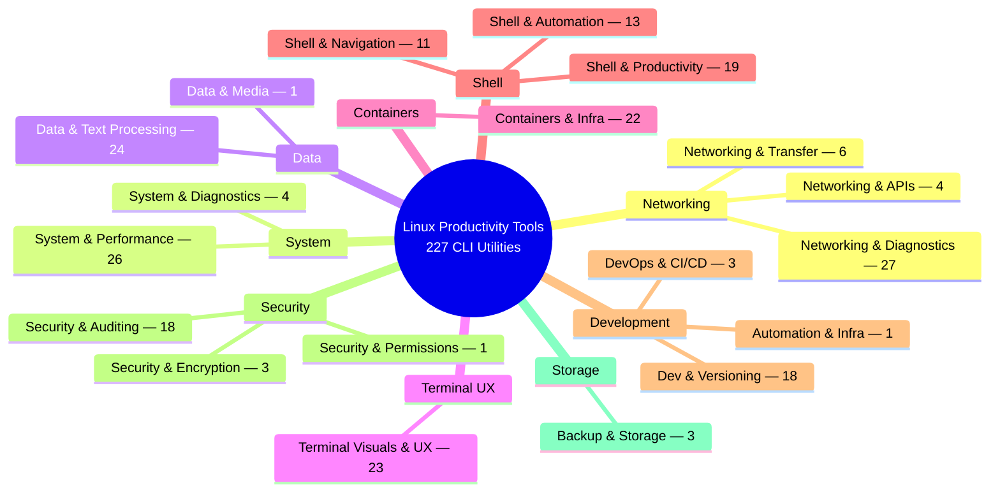

# Linux Productivity Tools: The Complete A–Z Reference

> **227 Essential CLI Utilities Across Infrastructure, Security, Networking, Performance & UX**

A GitHub-friendly Markdown edition of the supplied **Linux Productivity & Engineering Master Reference**. The 227 tool entries, descriptions, categories, and practical CLI examples are preserved from the source PDF; the layout is reformatted for easier GitHub browsing.

## 🧭 Quick Navigation

- [Domain Overview](#-domain-overview)
- [A](#a) · [B](#b) · [C](#c) · [D](#d) · [E](#e) · [F](#f) · [G](#g)
- [H](#h) · [I](#i) · [J](#j) · [K](#k) · [L](#l) · [M](#m) · [N](#n)
- [O](#o) · [P](#p) · [Q](#q) · [R](#r) · [S](#s) · [T](#t) · [U](#u)
- [V](#v) · [W](#w) · [X](#x) · [Y](#y) · [Z](#z)

## 📊 Domain Overview

### Tool count by domain

| Domain | Tools |
|---|---:|
| Networking & Diagnostics | 27 |
| System & Performance | 26 |
| Data & Text Processing | 24 |
| Terminal Visuals & UX | 23 |
| Containers & Infra | 22 |
| Shell & Productivity | 19 |
| Dev & Versioning | 18 |
| Security & Auditing | 18 |
| Shell & Automation | 13 |
| Shell & Navigation | 11 |
| Networking & Transfer | 6 |
| Networking & APIs | 4 |
| System & Diagnostics | 4 |
| Backup & Storage | 3 |
| DevOps & CI/CD | 3 |
| Security & Encryption | 3 |
| Automation & Infra | 1 |
| Data & Media | 1 |
| Security & Permissions | 1 |

## A

| Ch | Tool Name | Domain Category | Core Capabilities & Purpose | Practical CLI Example |
|---|---|---|---|---|
| A | `acl` | Security & Permissions | Inspect and manage POSIX file Access Control Lists (getfacl/setfacl) | `getfacl -R /var/www` |
| A | `act` | DevOps & CI/CD | Run GitHub Actions workflows locally inside Docker containers | `act -j test` |
| A | `age` | Security & Encryption | Simple, modern, and secure file encryption tool with small keys | `age -r <recipient_key>  doc.txt > doc.age` |
| A | `ansible` | Automation & Infra | Agentless IT configuration management and multi-node automation | `ansible-inventory --list` |
| A | `apparmor-utils` | Security & Auditing | Inspect and control AppArmor Mandatory Access Control profiles | `sudo aa-status` |
| A | `aria2c` | Networking & Transfer | Ultra-fast multi-protocol, multi-source parallel download accelerator | `aria2c -x 16 -s 16  https://example.com/file.iso` |
| A | `asciinema` | Terminal Visuals & UX | Record, replay, and share terminal sessions as text-based webcasts | `asciinema rec demo.cast` |
| A | `asciiquarium` | Terminal Visuals & UX | Terminal animation rendering a colorful living underwater aquarium | `asciiquarium` |
| A | `atop` | System & Performance | Advanced system and process monitor logging resource history over time | `atop -r  /var/log/atop/atop_today` |
| A | `atuin` | Shell & Productivity | Replaces shell history with SQLite encrypted sync and fuzzy search | `atuin search -i` |
| A | `auditd` | Security & Auditing | Linux audit framework for monitoring kernel events and syscalls | `sudo ausearch -m USER_LOGIN` |
| A | `awk` | Data & Text Processing | Pattern scanning, data extraction, and stream text processing language | `awk -F':' '{print $1, $3}'  /etc/passwd` |

## B

| Ch | Tool Name | Domain Category | Core Capabilities & Purpose | Practical CLI Example |
|---|---|---|---|---|
| B | `bandwhich` | Networking & Diagnostics | Terminal display showing current network utilization by process & IP | `sudo bandwhich --show-dns` |
| B | `bat` | Data & Text Processing | Enhanced cat clone featuring syntax highlighting and git diff marks | `bat --style=header,grid  server.py` |
| B | `bmon` | Networking & Diagnostics | Real-time bandwidth monitor and rate estimator with graphical meters | `bmon -p eth0` |
| B | `borg` | Backup & Storage | Deduplicating, authenticated, and compressed backup repository tool | `borg list /path/to/repo` |
| B | `bottom` | System & Performance | Customizable, cross-platform terminal system monitor in Rust (btm) | `btm --battery` |
| B | `bpftrace` | System & Diagnostics | High-level tracing language for Linux eBPF kernel instrumentation | `sudo bpftrace -e  'tracepoint:syscalls:sys_ente r_open { printf("%s\n",  comm); }'` |
| B | `broot` | Shell & Navigation | Interactive directory tree with instant fuzzy navigation and size visuals | `br -s` |
| B | `btop` | System & Performance | Resource monitor with responsive charts for CPU, RAM, disk, and net | `btop` |

## C

| Ch | Tool Name | Domain Category | Core Capabilities & Purpose | Practical CLI Example |
|---|---|---|---|---|
| C | `cacaview` | Terminal Visuals & UX | Color ASCII image viewer based on the libcaca library | `cacaview photo.png` |
| C | `cava` | Terminal Visuals & UX | Console-based cross-platform audio spectrum visualizer (ALSA/Pulse) | `cava` |
| C | `cbonsai` | Terminal Visuals & UX | Terminal bonsai tree growth generator and screensaver | `cbonsai --live` |
| C | `chafa` | Terminal Visuals & UX | High-performance terminal graphics and image canvas viewer | `chafa image.png` |
| C | `cheat` | Shell & Productivity | Interactive command-line cheat sheets with local custom sheets | `cheat rsync` |
| C | `chezmoi` | Shell & Productivity | Manage dotfiles across multiple machines securely with encryption | `chezmoi apply` |
| C | `choose` | Data & Text Processing | Human-friendly, fast alternative to cut and awk for field extraction | `cat file.txt \| choose 0 2 4` |
| C | `cmatrix` | Terminal Visuals & UX | Simulate the classic 'The Matrix' falling green code in terminal | `cmatrix -ab` |
| C | `colordiff` | Data & Text Processing | Wrapper around diff that produces colorized terminal syntax diffs | `colordiff file1.txt file2.txt` |
| C | `containerlab` | Containers & Infra | Declarative network topology lab orchestrator for containers | `containerlab deploy -t  lab.clab.yml` |
| C | `cpufetch` | Terminal Visuals & UX | Terminal CPU architecture and hardware feature visualizer | `cpufetch` |
| C | `croc` | Networking & Transfer | Easily and securely transfer files and folders between computers | `croc send file.zip` |
| C | `ctop` | Containers & Infra | Top-like real-time resource monitor for containers | `ctop` |
| C | `curl` | Networking & APIs | Command-line tool and library for transferring data with URLs | `curl -fsSL  https://get.docker.com` |
| C | `curlie` | Networking & APIs | Combines the ease of httpie with the speed and power of curl | `curlie GET  api.github.com/users` |

## D

| Ch | Tool Name | Domain Category | Core Capabilities & Purpose | Practical CLI Example |
|---|---|---|---|---|
| D | `delta` | Dev & Versioning | Syntax-highlighting pager for git, diff, and grep output | `git diff \| delta` |
| D | `dfc` | System & Performance | Display file system space usage using sleek graphs and colors | `dfc -d` |
| D | `dig` | Networking & Diagnostics | Flexible command-line tool for interrogating DNS name servers | `dig +short example.com A` |
| D | `direnv` | Shell & Productivity | Unclutter your .profile by loading directory-specific environment variables | `direnv allow .` |
| D | `dive` | Containers & Infra | Explore container image layers and find wasted space | `dive <image_tag>` |
| D | `docker` | Containers & Infra | Industry-standard container runtime, builder, and management utility | `docker ps -a` |
| D | `doggo` | Networking & Diagnostics | Human-friendly, modern DNS lookup client with JSON output and DoH/DoT | `doggo example.com @1.1.1.1` |
| D | `dstat` | System & Performance | Versatile replacement for vmstat, iostat, netstat and ifstat combined | `dstat -cdngy 2` |
| D | `duf` | System & Performance | Disk Usage/Free utility with clean tables, bar graphs, and colors | `duf` |
| D | `dust` | System & Performance | Intuitive, graphical tree-like disk usage visualization | `dust /home/kali` |

## E

| Ch | Tool Name | Domain Category | Core Capabilities & Purpose | Practical CLI Example |
|---|---|---|---|---|
| E | `entr` | Shell & Automation | Run arbitrary commands when observed files or folders change | `git ls-files \| entr pytest` |
| E | `envsubst` | Shell & Automation | Substitute environment variables inside template configuration files | `envsubst < template.conf >  production.conf` |
| E | `ethtool` | Networking & Diagnostics | Query and control network driver, interface, and hardware settings | `sudo ethtool eth0` |
| E | `eza` | Shell & Navigation | Modern, feature-rich replacement for ls with colors and git status | `eza -lah --git --icons` |

## F

| Ch | Tool Name | Domain Category | Core Capabilities & Purpose | Practical CLI Example |
|---|---|---|---|---|
| F | `fail2ban` | Security & Auditing | Intrusion prevention framework banning malicious IP addresses | `sudo fail2ban-client status` |
| F | `fastfetch` | Terminal Visuals & UX | Blazingly fast, modern system information fetch utility | `fastfetch` |
| F | `fd` | Shell & Navigation | Simple, fast, and user-friendly alternative to the find command | `fd -e conf nginx` |
| F | `ffmpeg` | Data & Media | Hyper-versatile CLI framework for recording, converting, and streaming media | `ffmpeg -i input.mp4  output.webm` |
| F | `figlet` | Terminal Visuals & UX | Generate large multi-line banner text using ASCII characters | `figlet 'Linux Admin'` |
| F | `fio` | System & Performance | Flexible I/O tester and benchmark suite for disks, NVMe, and filesystems | `fio --name=randread -- rw=randread --bs=4k --size=1G` |
| F | `fzf` | Shell & Productivity | Interactive command-line fuzzy finder for files, history, and streams | `fzf --preview 'bat -- color=always {}'` |

## G

| Ch | Tool Name | Domain Category | Core Capabilities & Purpose | Practical CLI Example |
|---|---|---|---|---|
| G | `getcap` | Security & Auditing | Inspect capabilities assigned to executable file binaries | `getcap -r /usr/bin` |
| G | `git` | Dev & Versioning | Ubiquitous distributed version control system for software source code | `git status -sb` |
| G | `gitleaks` | Security & Auditing | Audit Git repositories for committed secrets and API keys | `gitleaks detect --source . -v` |
| G | `glances` | System & Performance | Cross-platform curses-based system monitoring tool with web UI & API | `glances` |
| G | `glow` | Data & Text Processing | Terminal-based Markdown viewer, pager, and stash organizer | `glow README.md -p` |
| G | `goaccess` | System & Performance | Real-time web log analyzer and interactive terminal/HTML dashboard | `goaccess access.log -c` |
| G | `gping` | Networking & Diagnostics | Ping with a real-time graphical line chart inside the terminal | `gping 8.8.8.8 1.1.1.1` |
| G | `gron` | Data & Text Processing | Make JSON easily greppable by flattening objects into discrete assignments | `gron data.json \| grep  'servers[0]'` |
| G | `grype` | Security & Auditing | Fast vulnerability scanner for container images and filesystems | `grype <image_tag>` |

## H

| Ch | Tool Name | Domain Category | Core Capabilities & Purpose | Practical CLI Example |
|---|---|---|---|---|
| H | `helix` | Dev & Versioning | Post-modern modal text editor with built- in LSP, tree-sitter, and multiple selections |  |
| H | `helm` | Containers & Infra | Package manager and chart orchestrator for Kubernetes | `helm list -A` |
| H | `hexyl` | Data & Text Processing | Command-line hex viewer that uses colored bytes to distinguish categories | `hexyl /bin/ls` |
| H | `hping3` | Networking & Diagnostics | Command-line packet generator and network scanner for firewall testing | `sudo hping3 -S 192.168.1.1 -p  80 -c 5` |
| H | `htop` | System & Performance | Interactive process viewer, task manager, and system monitor | `htop -u root` |
| H | `httpie` | Networking & APIs | User-friendly CLI HTTP client with intuitive JSON formatting | `http GET api.github.com/users` |
| H | `hyperfine` | Shell & Automation | Command-line benchmarking tool with statistical cache-clearing | `hyperfine 'fd test' 'find . - name test'` |

## I

| Ch | Tool Name | Domain Category | Core Capabilities & Purpose | Practical CLI Example |
|---|---|---|---|---|
| I | `ifstat` | Networking & Diagnostics | Handy tool to monitor network interface traffic rates in real-time | `ifstat -t -i eth0 1` |
| I | `iftop` | Networking & Diagnostics | Real-time display of bandwidth usage by individual network host | `sudo iftop -i eth0` |
| I | `inxi` | Terminal Visuals & UX | Comprehensive, multi-source hardware and system configuration script | `inxi -Fz` |
| I | `iostat` | System & Performance | Report CPU statistics and input/output statistics for devices and partitions | `iostat -xz 1 5` |
| I | `iotop` | System & Performance | Real-time top-like I/O monitor showing disk read/write by process | `sudo iotop -oPa` |
| I | `ip` | Networking & Diagnostics | Comprehensive tool to show/manipulate routing, network devices, and tunnels | `ip -br a` |
| I | `ipcalc` | Networking & Diagnostics | Modern network calculator to broadcast, network, and Cisco wildcard calculations | `ipcalc 192.168.1.0/24` |
| I | `iperf3` | Networking & Diagnostics | Active network throughput, bandwidth, and jitter benchmarking tool | `iperf3 -c iperf3.moji.fr -p  5200` |
| I | `ipset` | Security & Auditing | Administer IP sets in the Linux kernel for massive firewall match speed | `sudo ipset list` |
| I | `iptables` | Security & Auditing | Inspect and manage legacy Linux packet filtering rules | `sudo iptables -L -n -v` |

## J

| Ch | Tool Name | Domain Category | Core Capabilities & Purpose | Practical CLI Example |
|---|---|---|---|---|
| J | `jless` | Data & Text Processing | Command-line interactive JSON viewer and explorer with folding syntax | `jless payload.json` |
| J | `jo` | Data & Text Processing | Small utility to create JSON objects and arrays straight from shell arguments | `jo -p name=demo port=8080  active=true` |
| J | `journalctl` | System & Performance | Query, inspect, and filter logs from the systemd journal service | `journalctl -u nginx.service - f` |
| J | `jp2a` | Terminal Visuals & UX | Convert JPEG and PNG images into monochrome/color ASCII art | `jp2a --color image.jpg` |
| J | `jq` | Data & Text Processing | Lightweight and flexible command-line JSON processor and filter | `cat config.json \| jq  '.servers[].ip'` |
| J | `just` | Shell & Automation | Pragmatic command runner inspired by make for managing project recipes | `just build` |

## K

| Ch | Tool Name | Domain Category | Core Capabilities & Purpose | Practical CLI Example |
|---|---|---|---|---|
| K | `k9s` | Containers & Infra | Interactive ncurses terminal UI for Kubernetes clusters | `k9s` |
| K | `kind` | Containers & Infra | Run local Kubernetes clusters using Docker container nodes | `kind create cluster --name  dev` |
| K | `krew` | Containers & Infra | Package manager for kubectl plugins to easily extend cluster capabilities | `kubectl krew install ctx` |
| K | `kubectl` | Containers & Infra | Command-line administration for Kubernetes clusters | `kubectl get pods -A` |
| K | `kubectx` | Containers & Infra | Fast switching between Kubernetes cluster contexts | `kubectx staging` |
| K | `kubens` | Containers & Infra | Fast switching between Kubernetes namespaces | `kubens production` |

## L

| Ch | Tool Name | Domain Category | Core Capabilities & Purpose | Practical CLI Example |
|---|---|---|---|---|
| L | `lazydocker` | Containers & Infra | Terminal UI for Docker container and image management | `lazydocker` |
| L | `lazygit` | Dev & Versioning | Interactive ncurses terminal UI for Git repository operations | `lazygit` |
| L | `lm-sensors` | System & Performance | Hardware health monitoring for CPU temperatures, voltages, and fans | `sensors` |
| L | `lnav` | Data & Text Processing | Advanced log file navigator with SQL syntax filtering and merging | `lnav /var/log/syslog  /var/log/nginx/` |
| L | `logcli` | DevOps & CI/CD | Command-line interface to Grafana Loki for log aggregation and queries | `logcli query  '{app="frontend"}'` |
| L | `lolcat` | Terminal Visuals & UX | Pipe filter that colorizes terminal text in rainbow gradients | `figlet 'Production' \| lolcat` |
| L | `lsblk` | System & Performance | List detailed information about all available block storage devices | `lsblk -f` |
| L | `lsof` | System & Diagnostics | List open files, network listening sockets, and associated active processes | `sudo lsof -i :80` |
| L | `ltrace` | System & Diagnostics | Intercept and record dynamic library calls called by executed processes | `ltrace ./app` |
| L | `lynis` | Security & Auditing | System security auditing and vulnerability hardening scanner | `sudo lynis audit system` |

## M

| Ch | Tool Name | Domain Category | Core Capabilities & Purpose | Practical CLI Example |
|---|---|---|---|---|
| M | `macchina` | Terminal Visuals & UX | Fast, highly customizable system information display in Rust | `macchina` |
| M | `mc` | Shell & Navigation | Midnight Commander - visual dual-pane terminal file manager | `mc` |
| M | `micro` | Dev & Versioning | Modern, intuitive terminal-based text editor with standard mouse & key bindings | `micro /etc/resolv.conf` |
| M | `minikube` | Containers & Infra | Local single-node Kubernetes cluster for testing | `minikube status` |
| M | `mise` | Dev & Versioning | Polyglot runtime version manager replacing asdf, nvm, and pyenv | `mise use node@20 python@3.12` |
| M | `moreutils` | Shell & Automation | Collection of classic Unix utilities (sponge, ts, vidir, pee) | `cat data.json \| sponge  data.json` |
| M | `mpstat` | System & Performance | Report individual processors and CPU-core utilization statistics | `mpstat -P ALL 1` |
| M | `mtr` | Networking & Diagnostics | Network diagnostic tool combining ping and traceroute capabilities | `mtr -rw 8.8.8.8` |
| M | `multitail` | Data & Text Processing | Monitor multiple log files simultaneously in separate terminal sub-windows | `multitail  /var/log/nginx/*.log` |

## N

| Ch | Tool Name | Domain Category | Core Capabilities & Purpose | Practical CLI Example |
|---|---|---|---|---|
| N | `navi` | Shell & Productivity | Interactive cheatsheet tool for CLI commands with param filling | `navi --query git` |
| N | `ncdu` | System & Performance | NCurses-based visual disk usage analyzer with fast interactive deletion | `ncdu /home` |
| N | `neofetch` | Terminal Visuals & UX | Classic ASCII-art system information display tool | `neofetch` |
| N | `neovim` | Dev & Versioning | Hyperextensible Vim-based modal text editor with Lua and LSP | `nvim main.py` |
| N | `netcat` | Networking & Diagnostics | Networking utility to read and write data across raw TCP/UDP connections | `nc -zv 192.168.1.1 22` |
| N | `nethogs` | Networking & Diagnostics | Net top tool grouping network bandwidth by process rather than per protocol | `sudo nethogs eth0` |
| N | `nft` | Security & Auditing | Inspect and manage modern nftables packet filtering rulesets | `sudo nft list ruleset` |
| N | `ngrep` | Networking & Diagnostics | Network packet grep utility matching payloads using regular expressions | `sudo ngrep -W byline  'GET\|POST' port 80` |
| N | `nmap` | Security & Auditing | Network exploration tool and security / port scanner | `nmap -sV -sC <target_ip>` |
| N | `nuclei` | Security & Auditing | Fast, template-powered vulnerability and exploit scanner | `nuclei -u https://HOST` |
| N | `numactl` | System & Performance | Control NUMA policy for processes and determine node memory allocation | `numactl --hardware` |

## O

| Ch | Tool Name | Domain Category | Core Capabilities & Purpose | Practical CLI Example |
|---|---|---|---|---|
| O | `onefetch` | Dev & Versioning | Git repository summary visualizer rendering project stats and logos | `onefetch` |
| O | `openssh` | Networking & Transfer | Secure network protocol suite for remote shell execution and file transfers | `ssh -i id_ed25519 user@host` |
| O | `openssl` | Security & Auditing | TLS/SSL cryptography toolkit for certificates, keys, and diagnostics | `openssl s_client -connect  host:443` |
| O | `ouch` | Data & Text Processing | Painless, blazing-fast compression and decompression for any format | `ouch decompress  archive.tar.zst` |

## P

| Ch | Tool Name | Domain Category | Core Capabilities & Purpose | Practical CLI Example |
|---|---|---|---|---|
| P | `packer` | Containers & Infra | Automated machine image builder for cloud and hypervisors | `packer validate .` |
| P | `parallel` | Shell & Automation | Execute concurrent CLI jobs across multiple CPU cores | `parallel echo ::: one two` |
| P | `pass` | Security & Auditing | Standard UNIX password manager using GPG and Git trees | `pass` |
| P | `perf` | System & Performance | Linux profiling and performance analysis tool for kernel and user code | `perf top` |
| P | `pigz` | Data & Text Processing | Parallel implementation of gzip for blazing-fast multi-threaded compression | `pigz -p 8 -k largefile.tar` |
| P | `ping` | Networking & Diagnostics | Verify network host reachability and round-trip latency (iputils) | `ping -c 4 1.1.1.1` |
| P | `pipes.sh` | Terminal Visuals & UX | Animated screen-saver drawing random interconnected 3D pipes | `pipes` |
| P | `podman` | Containers & Infra | Daemonless container engine for OCI containers and pods | `podman ps` |
| P | `podman-compose` | Containers & Infra | Run Docker-Compose specifications using rootless Podman containers | `podman-compose up -d` |
| P | `poppler-utils` | Terminal Visuals & UX | read PDFs directly inside the terminal | `pdftotext ospf.pdf -` |
| P | `prettyping` | Networking & Diagnostics | Wrapper around standard ping that colorizes and visualizes ping latencies | `prettyping 8.8.8.8` |
| P | `procs` | System & Performance | Modern, colored replacement for ps written in Rust with tree view | `procs --tree` |
| P | `progress` | Shell & Productivity | Coreutils viewer displaying progress percentages for cp, mv, dd, and tar | `progress -mp $!` |
| P | `pv` | Shell & Productivity | Pipe Viewer monitoring the progress of data through a pipeline in real time | `cat bigfile.iso \| pv \| dd  of=/dev/sdb` |
| P | `py-spy` | Dev & Versioning | Sampling profiler for Python programs that attaches without restarts | `py-spy top --pid 1234` |
| P | `pytest` | Dev & Versioning | Mature, full-featured Python testing framework for scripts and NetDevOps | `pytest -v tests/` |

## Q

| Ch | Tool Name | Domain Category | Core Capabilities & Purpose | Practical CLI Example |
|---|---|---|---|---|
| Q | `q` | Data & Text Processing | Execute SQL queries directly on tabular text files (CSV, TSV) | `q "SELECT c1, SUM(c2) FROM  data.csv GROUP BY c1"` |
| Q | `qemu` | Containers & Infra | Generic and open-source machine emulator and virtualizer | `qemu-system-x86_64 -m 2048 - cdrom os.iso` |
| Q | `qsv` | Data & Text Processing | High-performance multi-threaded CSV data-wrangling toolkit | `qsv stats dataset.csv` |

## R

| Ch | Tool Name | Domain Category | Core Capabilities & Purpose | Practical CLI Example |
|---|---|---|---|---|
| R | `ranger` | Shell & Navigation | Vim-inspired console file manager with preview columns and vi keys | `ranger` |
| R | `rclone` | Backup & Storage | Rsync for cloud storage (S3, GCS, OneDrive, Dropbox, SFTP, and WebDAV) | `rclone sync /local/data  remote:bucket` |
| R | `restic` | Backup & Storage | Fast, secure, authenticated, and encrypted backup program | `restic snapshots` |
| R | `ripgrep` | Shell & Navigation | Blazingly fast recursive regex search tool that respects .gitignore | `rg -i 'error_code' /var/log/` |
| R | `rlwrap` | Shell & Productivity | Add readline support to interactive tools lacking editing and history | `rlwrap some-cli` |
| R | `rsync` | Networking & Transfer | Fast, versatile remote and local incremental file copying utility | `rsync -avz --progress src/  dest/` |
| R | `rustscan` | Security & Auditing | Blazing-fast port scanner that scans all 65k ports in seconds before nmap | `rustscan -a 192.168.1.1 -- -A` |

## S

| Ch | Tool Name | Domain Category | Core Capabilities & Purpose | Practical CLI Example |
|---|---|---|---|---|
| S | `s-tui` | System & Performance | Terminal UI for monitoring CPU temperature, frequency, power and throttling | `s-tui` |
| S | `scp` | Networking & Transfer | Securely copy files between hosts over an encrypted SSH connection | `scp -r ./dist  user@remote:/var/www/` |
| S | `screenfetch` | Terminal Visuals & UX | Screenshot information tool displaying distro ASCII art and telemetry | `screenfetch` |
| S | `sed` | Data & Text Processing | Stream editor for filtering and transforming text using regular expressions | `sed -i 's/foo/bar/g'  config.txt` |
| S | `shellcheck` | Dev & Versioning | Static analysis and linting tool for sh/bash shell scripts | `shellcheck deploy.sh` |
| S | `smartctl` | System & Performance | Control and monitor S.M.A.R.T. disk hardware health and self-tests | `sudo smartctl -H /dev/nvme0n1` |
| S | `socat` | Networking & Diagnostics | Multipurpose relay establishing bidirectional byte streams across sockets | `socat TCP-LISTEN:8080,fork  TCP:10.0.0.2:80` |
| S | `sops` | Security & Encryption | Encrypt configuration secrets inside YAML, JSON, and ENV files | `sops config.enc.yaml` |
| S | `speedtest-cli` | Networking & Diagnostics | Test internet bandwidth download and upload speeds using Speedtest.net | `speedtest-cli --simple` |
| S | `sponge` | Shell & Automation | Soak up standard input completely before writing to output file (moreutils) | `cat config.json \| jq . \|  sponge config.json` |
| S | `ss` | Networking & Diagnostics | Socket statistics utility investigating open sockets and connections | `ss -tulpn` |
| S | `starship` | Shell & Productivity | Cross-shell customizable, blazingly fast prompt written in Rust | `starship init bash` |
| S | `stern` | Containers & Infra | Stream logs from multiple Kubernetes pods and containers simultaneously | `stern .` |
| S | `strace` | System & Diagnostics | Diagnostic debugging tool tracing system calls and signals of processes | `strace -c -p 1420` |
| S | `syft` | Security & Auditing | Generate software bills of materials (SBOM) from containers & directories | `syft IMAGE` |
| S | `sysstat` | System & Performance | Performance monitoring suite containing iostat, mpstat, and sar | `sar -u 1 5` |

## T

| Ch | Tool Name | Domain Category | Core Capabilities & Purpose | Practical CLI Example |
|---|---|---|---|---|
| T | `tcpdump` | Networking & Diagnostics | Powerful command-line packet analyzer capturing raw network traffic | `sudo tcpdump -i eth0 port 443  -nn` |
| T | `tealdeer` | Shell & Productivity | Fast implementation of tldr client written in pure Rust | `tldr ssh` |
| T | `terraform` | Containers & Infra | Infrastructure as code provisioning for cloud and on-prem hardware | `terraform plan` |
| T | `termshark` | Networking & Diagnostics | Terminal user interface for tshark (Wireshark) inspired by Wireshark layout | `termshark -i eth0` |
| T | `tig` | Dev & Versioning | Text-mode interface for Git functioning as an interactive git log & commit browser | `tig` |
| T | `time` | Shell & Automation | Measure precise execution time and hardware resource usage | `time pytest` |
| T | `timeout` | Shell & Automation | Limit command execution time and kill hung processes gracefully | `timeout 10s ping HOST` |
| T | `timg` | Terminal Visuals & UX | Display images and animations in terminals with high-res terminal graphics | `timg image.jpg` |
| T | `tldr` | Shell & Productivity | Short, community-driven practical command cheat sheets | `tldr tar` |
| T | `tmux` | Shell & Productivity | Persistent terminal sessions, window splitting, and workspace multiplexing | `tmux new-session -s dev` |
| T | `toilet` | Terminal Visuals & UX | Styled ASCII text with color and font filters | `toilet Linux` |
| T | `top` | System & Performance | Classic real-time interactive dynamic process viewer in Unix systems | `top -o %CPU` |
| T | `traceroute` | Networking & Diagnostics | Trace the packet hop path across IP networks to a remote host | `traceroute -n 8.8.8.8` |
| T | `trash-cli` | Shell & Productivity | Command line interface to the FreeDesktop.org trashcan preventing rm mishaps | `trash-put  unnecessary_file.txt` |
| T | `tree` | Shell & Navigation | Recursive directory listing program producing depth-indented trees | `tree -L 2 --dirsfirst` |
| T | `trivy` | Security & Auditing | Scan images, filesystems, Git repos, and configs for vulnerabilities | `trivy image IMAGE` |
| T | `ts` | Shell & Automation | Prepend high-resolution timestamps to every standard input line (moreutils) | `ping 8.8.8.8 \| ts '[%Y-%m-%d  %H:%M:%S]'` |
| T | `tshark` | Networking & Diagnostics | Terminal-oriented network packet analyzer (CLI Wireshark engine) | `tshark -i eth0 -f 'tcp port  80'` |
| T | `tty-clock` | Terminal Visuals & UX | Terminal clock with customizable colors and timer support | `tty-clock` |

## U

| Ch | Tool Name | Domain Category | Core Capabilities & Purpose | Practical CLI Example |
|---|---|---|---|---|
| U | `udisksctl` | System & Performance | Command line tool for querying and manipulating storage devices and media | `udisksctl status` |
| U | `ufw` | Security & Auditing | Manage host firewall rules simply and effectively | `sudo ufw status verbose` |
| U | `ugrep` | Shell & Navigation | Ultra-fast ultra-compatible grep with interactive TUI and regex searching | `ugrep -Q 'regex' /var/log/` |
| U | `unzip` | Data & Text Processing | Extract files from compressed ZIP archives preserving structure | `unzip -q archive.zip -d  /target/` |
| U | `upx` | Dev & Versioning | Ultimate Packer for eXecutables - compresses binary executables in-place | `upx --best binary_app` |
| U | `uv` | Dev & Versioning | Extremely fast Python package installer and virtualenv manager in Rust | `uv pip install -r  requirements.txt` |

## V

| Ch | Tool Name | Domain Category | Core Capabilities & Purpose | Practical CLI Example |
|---|---|---|---|---|
| V | `vagrant` | Containers & Infra | Manage development VMs and reproducible sandbox environments | `vagrant status` |
| V | `valgrind` | Dev & Versioning | Instrumentation framework for building dynamic analysis and memory leak tools | `valgrind --leak-check=full  ./my_prog` |
| V | `vault` | Security & Encryption | CLI client for managing secrets, certificates, and encryption keys with HashiCorp Vault | `vault kv get secret/app` |
| V | `viddy` | Shell & Productivity | Modern watch command replacement with time-machine diff viewing and paging | `viddy -d kubectl get pods` |
| V | `vidir` | Shell & Navigation | Edit directory contents and filenames inside your preferred text editor (moreutils) | `vidir *.log` |
| V | `vim` | Dev & Versioning | Terminal text editor with modal editing and massive plugin ecosystem | `vim file.txt` |
| V | `virsh` | Containers & Infra | Manage libvirt virtual machines and hypervisors | `virsh list --all` |
| V | `virt-top` | Containers & Infra | Monitor virtual machine and domain resource usage in real-time | `virt-top` |
| V | `visidata` | Data & Text Processing | Interactive data analysis and exploration terminal multitool | `visidata data.csv` |
| V | `viu` | Terminal Visuals & UX | Terminal image viewer supporting Kitty and Sixel graphics protocols | `viu image.png` |

## W

| Ch | Tool Name | Domain Category | Core Capabilities & Purpose | Practical CLI Example |
|---|---|---|---|---|
| W | `watch` | Shell & Productivity | Execute a program periodically, showing output fullscreen with diff highlights | `watch -d -n 2 ss -tulpn` |
| W | `watchexec` | Shell & Automation | Rerun commands automatically on file changes across directories | `watchexec pytest` |
| W | `wg` | Networking & Diagnostics | Configure and inspect state of modern fast WireGuard VPN interfaces | `sudo wg show` |
| W | `wget` | Networking & Transfer | Non-interactive network downloader supporting HTTP, HTTPS, and FTP | `wget -c  https://example.com/file.iso` |
| W | `whois` | Networking & Diagnostics | Client for the WHOIS directory service querying domain registration and IP allocations | `whois example.com` |

## X

| Ch | Tool Name | Domain Category | Core Capabilities & Purpose | Practical CLI Example |
|---|---|---|---|---|
| X | `xargs` | Shell & Automation | Build and execute command arguments from standard input streams | `printf '%s\n' *.log \| xargs  wc -l` |
| X | `xclip` | Shell & Productivity | Command line interface to the X11 clipboard for copy-paste pipelines | `cat ~/.ssh/id_rsa.pub \| xclip  -sel clip` |
| X | `xdotool` | Shell & Automation | Command-line X11 automation tool for simulating keyboard/mouse actions | `xdotool key Return` |
| X | `xh` | Networking & APIs | Fast and friendly HTTP tool sending requests with syntax colors | `xh get  https://httpbin.org/json` |
| X | `xsv` | Data & Text Processing | Fast CSV command line toolkit written in Rust for indexing and slicing | `xsv count dataset.csv` |
| X | `xz` | Data & Text Processing | High-ratio lossless data compressor utilizing the LZMA2 compression algorithm | `xz -v -9 backup.tar` |

## Y

| Ch | Tool Name | Domain Category | Core Capabilities & Purpose | Practical CLI Example |
|---|---|---|---|---|
| Y | `yamllint` | Dev & Versioning | Linter for YAML files to detect syntax errors, formatting, and key bugs | `yamllint -c .yamllint  config.yaml` |
| Y | `yarn` | DevOps & CI/CD | Fast, reliable, and secure JavaScript/Node dependency management tool | `yarn build` |
| Y | `yazi` | Shell & Navigation | Fast terminal file management with async preview and Vi keys | `yazi` |
| Y | `ydiff` | Dev & Versioning | Side-by-side and colored diff viewer supporting git diff and patch files | `git diff \| ydiff -s` |
| Y | `yq` | Data & Text Processing | YAML, JSON, XML, and TOML processor with jq syntax support | `yq '.services.web.image'  docker-compose.yml` |

## Z

| Ch | Tool Name | Domain Category | Core Capabilities & Purpose | Practical CLI Example |
|---|---|---|---|---|
| Z | `zathura` | Terminal Visuals & UX | Highly customizable and functional document and PDF viewer with vi keybindings | `zathura manual.pdf` |
| Z | `zellij` | Shell & Productivity | Terminal workspace and panes manager with layout support | `zellij` |
| Z | `zip` | Data & Text Processing | Package and compress files into standard portable ZIP archive files | `zip -r archive.zip src/` |
| Z | `zoxide` | Shell & Navigation | Smart directory navigation matching your frequent paths | `z project` |
| Z | `zsh` | Shell & Productivity | Advanced shell designed for interactive command line and scripting power | `zsh` |
| Z | `zstd` | Data & Text Processing | Real-time ultra-fast compression algorithm developed by Meta | `zstd -v -T0 backup.tar` |

---

**Source:** Linux Productivity & Engineering Master Reference — supplied PDF, 14 pages.

**Prepared for GitHub / LinkedIn sharing:** GitHub-compatible Markdown with a native Mermaid overview and alphabetically grouped reference tables.
