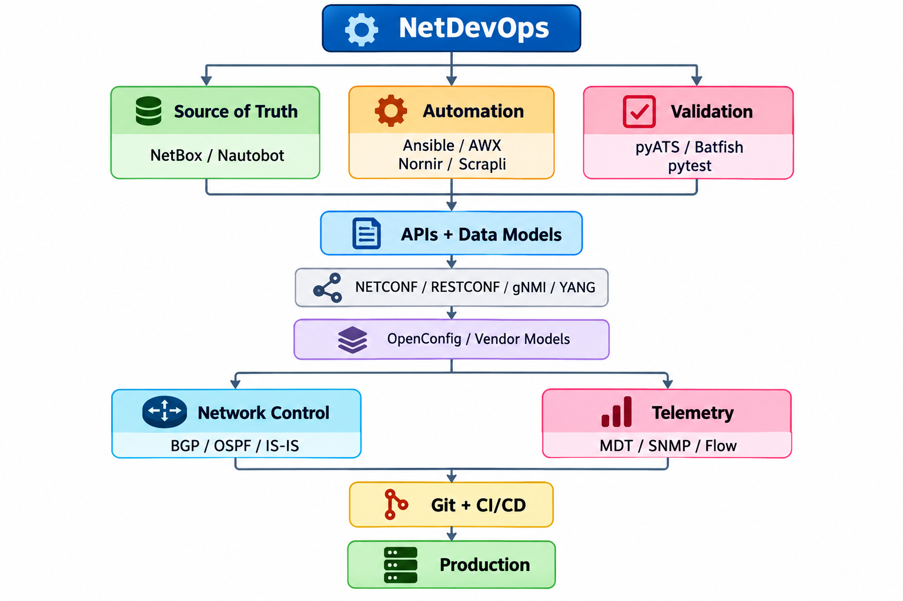
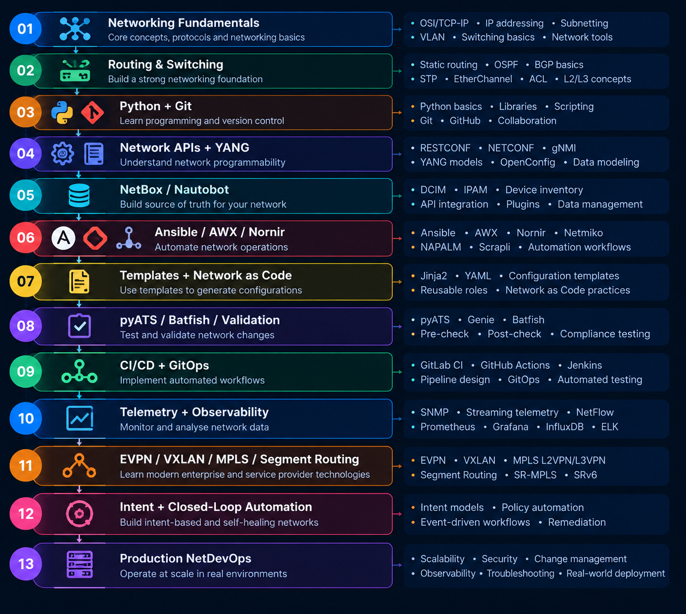

# 🌐 NetDevOps A–Z — Network Automation & Engineering Vocabulary

> **615 practical NetDevOps terms, tools, protocols, architectures, and
> engineering concepts.**
>
> A GitHub-ready reference focused on **network automation,
> programmability, routing, data-center networking, service-provider
> networking, telemetry, testing, security, source of truth, CI/CD,
> GitOps, and network operations**.

---

## 🧭 Quick Jump

### Alphabet

| [A](#a) | [B](#b) | [C](#c) | [D](#d) | [E](#e) | [F](#f) | [G](#g) | [H](#h) | [I](#i)                 |
|---------|---------|---------|---------|---------|---------|---------|---------|-------------------------|
| [J](#j) | [K](#k) | [L](#l) | [M](#m) | [N](#n) | [O](#o) | [P](#p) | [Q](#q) | [R](#r)                 |
| [S](#s) | [T](#t) | [U](#u) | [V](#v) | [W](#w) | [X](#x) | [Y](#y) | [Z](#z) | [All Terms](#all-terms) |

### Category Navigation

| Category                                 | Terms | Jump                                                                                |
|------------------------------------------|------:|-------------------------------------------------------------------------------------|
| **Automation & Orchestration**           |    51 | [Jump to Automation & Orchestration](#automation-orchestration)                     |
| **CI/CD & GitOps**                       |    26 | [Jump to CI/CD & GitOps](#ci-cd-gitops)                                             |
| **Cloud & Hybrid Networking**            |    17 | [Jump to Cloud & Hybrid Networking](#cloud-hybrid-networking)                       |
| **Configuration & Network as Code**      |    39 | [Jump to Configuration & Network as Code](#configuration-network-as-code)           |
| **Data Center & Fabric**                 |    34 | [Jump to Data Center & Fabric](#data-center-fabric)                                 |
| **Data Models & Programmability**        |    31 | [Jump to Data Models & Programmability](#data-models-programmability)               |
| **Device Access & APIs**                 |    37 | [Jump to Device Access & APIs](#device-access-apis)                                 |
| **Lab & Simulation**                     |    19 | [Jump to Lab & Simulation](#lab-simulation)                                         |
| **Linux & Network OS**                   |    23 | [Jump to Linux & Network OS](#linux-network-os)                                     |
| **Monitoring & Operations**              |    29 | [Jump to Monitoring & Operations](#monitoring-operations)                           |
| **Network Architecture & Design**        |    22 | [Jump to Network Architecture & Design](#network-architecture-design)               |
| **Packet Processing & Linux Networking** |    19 | [Jump to Packet Processing & Linux Networking](#packet-processing-linux-networking) |
| **Provisioning & Lifecycle**             |    19 | [Jump to Provisioning & Lifecycle](#provisioning-lifecycle)                         |
| **Routing & Control Plane**              |    49 | [Jump to Routing & Control Plane](#routing-control-plane)                           |
| **Security & Access**                    |    33 | [Jump to Security & Access](#security-access)                                       |
| **Service Provider & WAN**               |    40 | [Jump to Service Provider & WAN](#service-provider-wan)                             |
| **Source of Truth & Inventory**          |    51 | [Jump to Source of Truth & Inventory](#source-of-truth-inventory)                   |
| **Telemetry & Observability**            |    36 | [Jump to Telemetry & Observability](#telemetry-observability)                       |
| **Testing & Validation**                 |    40 | [Jump to Testing & Validation](#testing-validation)                                 |

---

## 🧠 NetDevOps Mind Map

```mermaid
flowchart LR

    N["🌐 NETDEVOPS<br/><b>615 TERMS</b>"]

    N --> A["⚙️ Automation<br/>& Orchestration<br/><b>51</b>"]
    N --> B["📦 Source of Truth<br/>& Inventory<br/><b>51</b>"]
    N --> C["🧪 Testing<br/>& Validation<br/><b>40</b>"]
    N --> D["🔧 Configuration<br/>& Network as Code<br/><b>39</b>"]
    N --> E["🧭 Routing<br/>& Control Plane<br/><b>49</b>"]
    N --> F["🏢 Data Center<br/>& Fabric<br/><b>34</b>"]
    N --> G["🌐 Service Provider<br/>& WAN<br/><b>40</b>"]
    N --> H["🔐 Security<br/>& Access<br/><b>33</b>"]
    N --> I["📡 Telemetry<br/>& Observability<br/><b>36</b>"]
    N --> J["📊 Monitoring<br/>& Operations<br/><b>29</b>"]
    N --> K["💻 Device Access<br/>& APIs<br/><b>26</b>"]
    N --> L["🧩 Data Models<br/>& Programmability<br/><b>31</b>"]
    N --> M["🐧 Linux<br/>& Network OS<br/><b>23</b>"]
    N --> O["🧪 Lab<br/>& Simulation<br/><b>19</b>"]
    N --> P["🚀 Provisioning<br/>& Lifecycle<br/><b>19</b>"]
    N --> Q["🔄 CI/CD<br/>& GitOps<br/><b>26</b>"]
    N --> R["☁️ Cloud<br/>& Hybrid Networking<br/><b>17</b>"]
    N --> S["⚡ Packet Processing<br/>& Linux Networking<br/><b>19</b>"]
    N --> T["🏗️ Network Architecture<br/>& Design<br/><b>22</b>"]

    %% Core
    style N fill:#0969da,color:#ffffff,stroke:#0550ae,stroke-width:3px

    %% Categories
    style A fill:#ddf4ff,stroke:#54aeff,color:#24292f
    style B fill:#dcffe4,stroke:#4ac26b,color:#24292f
    style C fill:#fff8c5,stroke:#d4a72c,color:#24292f
    style D fill:#fbefff,stroke:#bf3989,color:#24292f
    style E fill:#fbefff,stroke:#8250df,color:#24292f
    style F fill:#fff1e5,stroke:#bc6d00,color:#24292f
    style G fill:#ffebe9,stroke:#cf222e,color:#24292f
    style H fill:#fbefff,stroke:#bf3989,color:#24292f
    style I fill:#ddf4ff,stroke:#0969da,color:#24292f
    style J fill:#ddf4ff,stroke:#218bff,color:#24292f
    style K fill:#eaeef2,stroke:#57606a,color:#24292f
    style L fill:#fff8c5,stroke:#d4a72c,color:#24292f
    style M fill:#dafbe1,stroke:#1a7f37,color:#24292f
    style O fill:#eaeef2,stroke:#57606a,color:#24292f
    style P fill:#dafbe1,stroke:#1a7f37,color:#24292f
    style Q fill:#ddf4ff,stroke:#0969da,color:#24292f
    style R fill:#eaeef2,stroke:#8250df,color:#24292f
    style S fill:#fff8c5,stroke:#bf8700,color:#24292f
    style T fill:#ddf4ff,stroke:#0969da,color:#24292f

    %% Central links
    linkStyle default stroke:#8b949e,stroke-width:2px
```

> **Tip:** Each branch shows the **category name and its term count**.

---

## 🏷️ Category Overview

| Category                                                                    | Focus                                                                     | Terms |
|-----------------------------------------------------------------------------|---------------------------------------------------------------------------|------:|
| [Automation & Orchestration](#automation-orchestration)                     | Ansible, AWX, Nornir, Scrapli and reusable workflows                      |    51 |
| [CI/CD & GitOps](#ci-cd-gitops)                                             | Git, GitHub Actions, GitLab CI, Jenkins, reviews and deployment gates     |    26 |
| [Cloud & Hybrid Networking](#cloud-hybrid-networking)                       | VPC/VNet, transit, VPN, NAT and dedicated cloud connectivity              |    17 |
| [Configuration & Network as Code](#configuration-network-as-code)           | Desired state, templates, rendering, drift and policy as code             |    39 |
| [Data Center & Fabric](#data-center-fabric)                                 | EVPN, VXLAN, leaf-spine, ECMP and fabric gateways                         |    34 |
| [Data Models & Programmability](#data-models-programmability)               | YANG, OpenConfig, schemas and model-driven automation                     |    31 |
| [Device Access & APIs](#device-access-apis)                                 | CLI, SSH, NETCONF, RESTCONF and programmable device interfaces            |    37 |
| [Lab & Simulation](#lab-simulation)                                         | Containerlab, EVE-NG, GNS3, CML, QEMU and virtual network OS              |    19 |
| [Linux & Network OS](#linux-network-os)                                     | IOS, IOS XE/XR, NX-OS, Junos, EOS, SONiC and Linux networking             |    23 |
| [Monitoring & Operations](#monitoring-operations)                           | NOC, incidents, changes, baselines, SLOs and operational response         |    29 |
| [Network Architecture & Design](#network-architecture-design)               | Core/access, underlay/overlay, redundancy, topology and traffic direction |    22 |
| [Packet Processing & Linux Networking](#packet-processing-linux-networking) | eBPF, XDP, DPDK, P4, Open vSwitch and Linux datapaths                     |    19 |
| [Provisioning & Lifecycle](#provisioning-lifecycle)                         | Day-0/1/2, onboarding, staging, upgrades and ZTP                          |    19 |
| [Routing & Control Plane](#routing-control-plane)                           | BGP, OSPF, IS-IS, EIGRP, BFD and routing policy                           |    49 |
| [Security & Access](#security-access)                                       | AAA, RADIUS, TACACS+, RPKI, PKI, ACLs and Zero Trust                      |    33 |
| [Service Provider & WAN](#service-provider-wan)                             | MPLS, L2/L3VPN, Segment Routing, SD-WAN and traffic engineering           |    40 |
| [Source of Truth & Inventory](#source-of-truth-inventory)                   | NetBox, Nautobot, IPAM, DCIM and authoritative infrastructure data        |    51 |
| [Telemetry & Observability](#telemetry-observability)                       | SNMP, MDT, gNMI telemetry, flow records and metrics                       |    36 |
| [Testing & Validation](#testing-validation)                                 | Batfish, pyATS, pytest, topology, reachability and change validation      |    40 |

---

## 🔤 All Terms

> Alphabetical reference. Every letter below has its own GitHub anchor.

### A

| Alphabet | Term                          | One-line explanation                                  | Category                                                                    |
|:--------:|-------------------------------|-------------------------------------------------------|-----------------------------------------------------------------------------|
|  **A**   | **AAA**                       | Authentication, authorization, and accounting         | [Security & Access](#security-access)                                       |
|  **A**   | **ABR**                       | OSPF Area Border Router                               | [Routing & Control Plane](#routing-control-plane)                           |
|  **A**   | **Access Layer**              | Network layer connecting endpoints                    | [Network Architecture & Design](#network-architecture-design)               |
|  **A**   | **ACL**                       | Rule set controlling network traffic                  | [Security & Access](#security-access)                                       |
|  **A**   | **Action Plugin**             | Ansible plugin implementing controller-side logic     | [Automation & Orchestration](#automation-orchestration)                     |
|  **A**   | **Ad-hoc Command**            | One-time automation task                              | [Automation & Orchestration](#automation-orchestration)                     |
|  **A**   | **AF_XDP**                    | High-performance Linux packet I/O interface           | [Packet Processing & Linux Networking](#packet-processing-linux-networking) |
|  **A**   | **Aggregation Layer**         | Network layer consolidating access connectivity       | [Network Architecture & Design](#network-architecture-design)               |
|  **A**   | **Alert Correlation**         | Combining related alerts                              | [Monitoring & Operations](#monitoring-operations)                           |
|  **A**   | **Ansible**                   | Agentless infrastructure automation engine            | [Automation & Orchestration](#automation-orchestration)                     |
|  **A**   | **Ansible Collection**        | Packaged Ansible content                              | [Automation & Orchestration](#automation-orchestration)                     |
|  **A**   | **Ansible Galaxy**            | Repository for Ansible roles and collections          | [Automation & Orchestration](#automation-orchestration)                     |
|  **A**   | **Ansible Module**            | Reusable automation operation                         | [Automation & Orchestration](#automation-orchestration)                     |
|  **A**   | **Ansible Navigator**         | CLI for Ansible content execution                     | [Automation & Orchestration](#automation-orchestration)                     |
|  **A**   | **Ansible Playbook**          | YAML-defined automation workflow                      | [Automation & Orchestration](#automation-orchestration)                     |
|  **A**   | **Ansible Role**              | Reusable Ansible automation structure                 | [Automation & Orchestration](#automation-orchestration)                     |
|  **A**   | **Ansible Vault**             | Encrypted storage for automation secrets              | [Automation & Orchestration](#automation-orchestration)                     |
|  **A**   | **Anycast**                   | Same address advertised from multiple locations       | [Network Architecture & Design](#network-architecture-design)               |
|  **A**   | **Anycast Gateway**           | Shared gateway address across fabric leaf switches    | [Data Center & Fabric](#data-center-fabric)                                 |
|  **A**   | **API Client**                | Software component calling a network API              | [Device Access & APIs](#device-access-apis)                                 |
|  **A**   | **API Endpoint**              | Addressable programmable interface resource           | [Device Access & APIs](#device-access-apis)                                 |
|  **A**   | **API Schema**                | Formal definition of an API request and response      | [Device Access & APIs](#device-access-apis)                                 |
|  **A**   | **API Token**                 | Credential used to authenticate API calls             | [Device Access & APIs](#device-access-apis)                                 |
|  **A**   | **API Version**               | Version identifier for an API contract                | [Device Access & APIs](#device-access-apis)                                 |
|  **A**   | **Approval Gate**             | Manual or automated approval checkpoint               | [CI/CD & GitOps](#ci-cd-gitops)                                             |
|  **A**   | **Arista EOS**                | Arista network operating system                       | [Linux & Network OS](#linux-network-os)                                     |
|  **A**   | **ARP Inspection**            | Validation of ARP messages                            | [Security & Access](#security-access)                                       |
|  **A**   | **Artifact**                  | Stored output produced by a pipeline                  | [CI/CD & GitOps](#ci-cd-gitops)                                             |
|  **A**   | **Artifact Repository**       | Repository storing pipeline outputs                   | [CI/CD & GitOps](#ci-cd-gitops)                                             |
|  **A**   | **ASBR**                      | OSPF Autonomous System Boundary Router                | [Routing & Control Plane](#routing-control-plane)                           |
|  **A**   | **Assertion**                 | Condition that a validation test expects to be true   | [Testing & Validation](#testing-validation)                                 |
|  **A**   | **Asset Tag**                 | Identifier assigned to an infrastructure asset        | [Source of Truth & Inventory](#source-of-truth-inventory)                   |
|  **A**   | **Augment**                   | YANG mechanism for extending an existing model        | [Data Models & Programmability](#data-models-programmability)               |
|  **A**   | **Automation Controller**     | Central platform for running automation               | [Automation & Orchestration](#automation-orchestration)                     |
|  **A**   | **Automation Controller Job** | Executable job definition in an automation controller | [Automation & Orchestration](#automation-orchestration)                     |
|  **A**   | **Automation Credential**     | Stored credential used by an automation job           | [Automation & Orchestration](#automation-orchestration)                     |
|  **A**   | **AWS Transit Gateway**       | AWS managed routing hub                               | [Cloud & Hybrid Networking](#cloud-hybrid-networking)                       |
|  **A**   | **AWX**                       | Open-source Ansible automation controller             | [Automation & Orchestration](#automation-orchestration)                     |
|  **A**   | **Azure VNet**                | Azure virtual network                                 | [Cloud & Hybrid Networking](#cloud-hybrid-networking)                       |

[↑ Quick Jump](#-quick-jump)

### B

| Alphabet | Term                     | One-line explanation                                     | Category                                                                    |
|:--------:|--------------------------|----------------------------------------------------------|-----------------------------------------------------------------------------|
|  **B**   | **Baseline**             | Reference for normal network behavior                    | [Monitoring & Operations](#monitoring-operations)                           |
|  **B**   | **Batfish**              | Network configuration analysis and validation platform   | [Testing & Validation](#testing-validation)                                 |
|  **B**   | **BFD**                  | Fast forwarding-path failure detection                   | [Routing & Control Plane](#routing-control-plane)                           |
|  **B**   | **BGP**                  | Inter-domain path-vector routing protocol                | [Routing & Control Plane](#routing-control-plane)                           |
|  **B**   | **BGP Add-Path**         | BGP feature carrying multiple paths                      | [Routing & Control Plane](#routing-control-plane)                           |
|  **B**   | **BGP Best Path**        | Selected preferred BGP route                             | [Routing & Control Plane](#routing-control-plane)                           |
|  **B**   | **BGP Community**        | BGP attribute used for route policy                      | [Routing & Control Plane](#routing-control-plane)                           |
|  **B**   | **BGP Confederation**    | BGP scaling using internal sub-ASes                      | [Routing & Control Plane](#routing-control-plane)                           |
|  **B**   | **BGP Dampening**        | Suppresses unstable route advertisements                 | [Routing & Control Plane](#routing-control-plane)                           |
|  **B**   | **BGP EVPN**             | BGP control plane for Ethernet VPN                       | [Routing & Control Plane](#routing-control-plane)                           |
|  **B**   | **BGP Graceful Restart** | BGP mechanism preserving forwarding during restart       | [Routing & Control Plane](#routing-control-plane)                           |
|  **B**   | **BGP Local Preference** | Attribute influencing outbound path selection            | [Routing & Control Plane](#routing-control-plane)                           |
|  **B**   | **BGP Maximum Prefix**   | Limit protecting a session from excessive routes         | [Routing & Control Plane](#routing-control-plane)                           |
|  **B**   | **BGP MED**              | Attribute influencing inbound path selection             | [Routing & Control Plane](#routing-control-plane)                           |
|  **B**   | **BGP Multipath**        | Allowing multiple equal BGP paths                        | [Routing & Control Plane](#routing-control-plane)                           |
|  **B**   | **BGP Next Hop**         | Next-hop address carried by BGP                          | [Routing & Control Plane](#routing-control-plane)                           |
|  **B**   | **BGP Next-Hop-Self**    | BGP policy replacing the advertised next hop             | [Routing & Control Plane](#routing-control-plane)                           |
|  **B**   | **BGP Peer Group**       | Shared configuration for BGP neighbors                   | [Routing & Control Plane](#routing-control-plane)                           |
|  **B**   | **BGP Prefix Limit**     | Limit on accepted BGP routes                             | [Routing & Control Plane](#routing-control-plane)                           |
|  **B**   | **BGP Route Reflector**  | Reduces iBGP full-mesh requirements                      | [Routing & Control Plane](#routing-control-plane)                           |
|  **B**   | **BGP Route Server**     | BGP speaker simplifying exchange-point peering           | [Routing & Control Plane](#routing-control-plane)                           |
|  **B**   | **BGP Unnumbered**       | BGP peering without numbered interfaces                  | [Routing & Control Plane](#routing-control-plane)                           |
|  **B**   | **BGP Update**           | BGP message carrying routing changes                     | [Routing & Control Plane](#routing-control-plane)                           |
|  **B**   | **BGP VPNv4**            | BGP address family carrying IPv4 VPN routes              | [Service Provider & WAN](#service-provider-wan)                             |
|  **B**   | **BGP VPNv6**            | BGP address family carrying IPv6 VPN routes              | [Service Provider & WAN](#service-provider-wan)                             |
|  **B**   | **BGP-LS**               | BGP distribution of topology information                 | [Routing & Control Plane](#routing-control-plane)                           |
|  **B**   | **Block**                | Reusable grouping of automation tasks                    | [Automation & Orchestration](#automation-orchestration)                     |
|  **B**   | **Bootstrap**            | Initial configuration process                            | [Provisioning & Lifecycle](#provisioning-lifecycle)                         |
|  **B**   | **Border Gateway**       | Fabric node providing external connectivity              | [Data Center & Fabric](#data-center-fabric)                                 |
|  **B**   | **Border Leaf**          | Leaf connecting a fabric to external networks            | [Data Center & Fabric](#data-center-fabric)                                 |
|  **B**   | **BPF**                  | Linux packet-processing technology                       | [Packet Processing & Linux Networking](#packet-processing-linux-networking) |
|  **B**   | **Branch**               | Independent line of Git development                      | [CI/CD & GitOps](#ci-cd-gitops)                                             |
|  **B**   | **Branch Protection**    | Rules restricting direct repository changes              | [CI/CD & GitOps](#ci-cd-gitops)                                             |
|  **B**   | **Bridge FDB**           | Linux bridge forwarding database                         | [Packet Processing & Linux Networking](#packet-processing-linux-networking) |
|  **B**   | **Broadcast Domain**     | Layer-2 area receiving broadcasts                        | [Network Architecture & Design](#network-architecture-design)               |
|  **B**   | **BusyBox**              | Compact Unix utility collection often used in appliances | [Linux & Network OS](#linux-network-os)                                     |

[↑ Quick Jump](#-quick-jump)

### C

| Alphabet | Term                        | One-line explanation                                       | Category                                                          |
|:--------:|-----------------------------|------------------------------------------------------------|-------------------------------------------------------------------|
|  **C**   | **Cable**                   | Physical link between network endpoints                    | [Source of Truth & Inventory](#source-of-truth-inventory)         |
|  **C**   | **Cable ID**                | Identifier assigned to a physical network cable            | [Source of Truth & Inventory](#source-of-truth-inventory)         |
|  **C**   | **Callback Plugin**         | Ansible plugin receiving execution events                  | [Automation & Orchestration](#automation-orchestration)           |
|  **C**   | **Candidate Configuration** | Staged configuration awaiting activation                   | [Configuration & Network as Code](#configuration-network-as-code) |
|  **C**   | **Carrier Ethernet**        | Provider-grade Ethernet service                            | [Service Provider & WAN](#service-provider-wan)                   |
|  **C**   | **Carrier Grade NAT**       | Large-scale address translation for providers              | [Service Provider & WAN](#service-provider-wan)                   |
|  **C**   | **Carrier NAT**             | Provider-scale network address translation                 | [Service Provider & WAN](#service-provider-wan)                   |
|  **C**   | **Change Advisory Board**   | Group reviewing significant operational changes            | [Monitoring & Operations](#monitoring-operations)                 |
|  **C**   | **Change Record**           | Documented record of an infrastructure change              | [Monitoring & Operations](#monitoring-operations)                 |
|  **C**   | **Change Ticket**           | Recorded request for an infrastructure change              | [Monitoring & Operations](#monitoring-operations)                 |
|  **C**   | **Change Validation**       | Verification that a network change behaved correctly       | [Testing & Validation](#testing-validation)                       |
|  **C**   | **Change Window**           | Approved period for network changes                        | [Monitoring & Operations](#monitoring-operations)                 |
|  **C**   | **Check Mode**              | Automation mode that reports changes without applying them | [Automation & Orchestration](#automation-orchestration)           |
|  **C**   | **Choice**                  | YANG construct selecting among alternative data structures | [Data Models & Programmability](#data-models-programmability)     |
|  **C**   | **Circuit**                 | Provisioned logical or physical connectivity service       | [Source of Truth & Inventory](#source-of-truth-inventory)         |
|  **C**   | **Circuit ID**              | Identifier assigned to a provider circuit                  | [Source of Truth & Inventory](#source-of-truth-inventory)         |
|  **C**   | **Circuit Inventory**       | Inventory of provider connectivity circuits                | [Source of Truth & Inventory](#source-of-truth-inventory)         |
|  **C**   | **CLI**                     | Command-line interface to a network device                 | [Device Access & APIs](#device-access-apis)                       |
|  **C**   | **CLI Command**             | Instruction entered through a device CLI                   | [Device Access & APIs](#device-access-apis)                       |
|  **C**   | **Cloud Interconnect**      | Dedicated connectivity into cloud infrastructure           | [Cloud & Hybrid Networking](#cloud-hybrid-networking)             |
|  **C**   | **Cloud NAT**               | Managed network address translation service                | [Cloud & Hybrid Networking](#cloud-hybrid-networking)             |
|  **C**   | **Cloud Router**            | Managed cloud routing service                              | [Cloud & Hybrid Networking](#cloud-hybrid-networking)             |
|  **C**   | **Cloud VPN**               | Encrypted connectivity to cloud networks                   | [Cloud & Hybrid Networking](#cloud-hybrid-networking)             |
|  **C**   | **Cluster Inventory**       | Inventory of nodes belonging to a cluster                  | [Source of Truth & Inventory](#source-of-truth-inventory)         |
|  **C**   | **CMDB**                    | Configuration database for infrastructure assets           | [Source of Truth & Inventory](#source-of-truth-inventory)         |
|  **C**   | **CML**                     | Cisco Modeling Labs                                        | [Lab & Simulation](#lab-simulation)                               |
|  **C**   | **Code Review**             | Human review of proposed automation changes                | [CI/CD & GitOps](#ci-cd-gitops)                                   |
|  **C**   | **Collapsed Core**          | Architecture combining core and aggregation                | [Network Architecture & Design](#network-architecture-design)     |
|  **C**   | **Commit**                  | Recorded set of Git changes                                | [CI/CD & GitOps](#ci-cd-gitops)                                   |
|  **C**   | **Commit Hook**             | Automated action triggered by a Git commit                 | [CI/CD & GitOps](#ci-cd-gitops)                                   |
|  **C**   | **Compliance Test**         | Check against a required standard                          | [Testing & Validation](#testing-validation)                       |
|  **C**   | **Condition**               | Expression controlling whether an automation task runs     | [Automation & Orchestration](#automation-orchestration)           |
|  **C**   | **Config Compliance**       | Comparison against an approved configuration standard      | [Configuration & Network as Code](#configuration-network-as-code) |
|  **C**   | **Config Diff**             | Difference between two configurations                      | [Configuration & Network as Code](#configuration-network-as-code) |
|  **C**   | **Config Generator**        | Program that produces device configuration                 | [Configuration & Network as Code](#configuration-network-as-code) |
|  **C**   | **Config Normalization**    | Converting configuration into a consistent structure       | [Configuration & Network as Code](#configuration-network-as-code) |
|  **C**   | **Config Repository**       | Version-controlled configuration storage                   | [Configuration & Network as Code](#configuration-network-as-code) |
|  **C**   | **Config Schema**           | Formal structure for configuration data                    | [Configuration & Network as Code](#configuration-network-as-code) |
|  **C**   | **Configlet**               | Reusable configuration fragment                            | [Configuration & Network as Code](#configuration-network-as-code) |
|  **C**   | **Configuration Archive**   | Historical device configuration collection                 | [Configuration & Network as Code](#configuration-network-as-code) |
|  **C**   | **Configuration Drift**     | Difference between intended and actual state               | [Configuration & Network as Code](#configuration-network-as-code) |
|  **C**   | **Configuration Rendering** | Generating device configuration from data                  | [Configuration & Network as Code](#configuration-network-as-code) |
|  **C**   | **Configuration Test**      | Test validating device configuration                       | [Testing & Validation](#testing-validation)                       |
|  **C**   | **Connection Plugin**       | Ansible component defining device transport                | [Automation & Orchestration](#automation-orchestration)           |
|  **C**   | **Connectivity Test**       | Test verifying reachability                                | [Testing & Validation](#testing-validation)                       |
|  **C**   | **Console Access**          | Local or remote access through a device console            | [Device Access & APIs](#device-access-apis)                       |
|  **C**   | **Console Server**          | System providing remote serial-console access              | [Device Access & APIs](#device-access-apis)                       |
|  **C**   | **Contact**                 | Operational ownership information for an asset             | [Source of Truth & Inventory](#source-of-truth-inventory)         |
|  **C**   | **Contact Assignment**      | Association between an asset and an owner                  | [Source of Truth & Inventory](#source-of-truth-inventory)         |
|  **C**   | **Container**               | YANG node grouping related data                            | [Data Models & Programmability](#data-models-programmability)     |
|  **C**   | **Containerized Router**    | Network OS running inside a container                      | [Lab & Simulation](#lab-simulation)                               |
|  **C**   | **Containerlab**            | Container-based network lab platform                       | [Lab & Simulation](#lab-simulation)                               |
|  **C**   | **Continuous Delivery**     | Automated preparation for release                          | [CI/CD & GitOps](#ci-cd-gitops)                                   |
|  **C**   | **Continuous Integration**  | Automated integration and testing                          | [CI/CD & GitOps](#ci-cd-gitops)                                   |
|  **C**   | **Control Plane Policing**  | Protection of the device control plane                     | [Security & Access](#security-access)                             |
|  **C**   | **Control-Plane Test**      | Test validating routing and control-plane behavior         | [Testing & Validation](#testing-validation)                       |
|  **C**   | **Convergence Test**        | Test verifying expected network convergence                | [Testing & Validation](#testing-validation)                       |
|  **C**   | **CoPP**                    | Control-plane protection policy                            | [Security & Access](#security-access)                             |
|  **C**   | **Core Layer**              | High-speed backbone layer                                  | [Network Architecture & Design](#network-architecture-design)     |
|  **C**   | **Counter**                 | Monotonic or sampled operational measurement               | [Telemetry & Observability](#telemetry-observability)             |
|  **C**   | **Counter64**               | 64-bit SNMP counter for high-volume interfaces             | [Telemetry & Observability](#telemetry-observability)             |
|  **C**   | **Credential Plugin**       | Component supplying automation credentials                 | [Automation & Orchestration](#automation-orchestration)           |
|  **C**   | **CSR1000v**                | Virtual Cisco IOS XE router                                | [Lab & Simulation](#lab-simulation)                               |
|  **C**   | **Cumulus Linux**           | Linux-based network operating system                       | [Linux & Network OS](#linux-network-os)                           |

[↑ Quick Jump](#-quick-jump)

### D

| Alphabet | Term                       | One-line explanation                                 | Category                                                                    |
|:--------:|----------------------------|------------------------------------------------------|-----------------------------------------------------------------------------|
|  **D**   | **Data Model**             | Structured representation of network data            | [Data Models & Programmability](#data-models-programmability)               |
|  **D**   | **Day-0**                  | Initial provisioning phase                           | [Provisioning & Lifecycle](#provisioning-lifecycle)                         |
|  **D**   | **Day-1**                  | Initial configuration and service deployment phase   | [Provisioning & Lifecycle](#provisioning-lifecycle)                         |
|  **D**   | **Day-2**                  | Ongoing operational management phase                 | [Provisioning & Lifecycle](#provisioning-lifecycle)                         |
|  **D**   | **DCIM**                   | Data-center infrastructure management                | [Source of Truth & Inventory](#source-of-truth-inventory)                   |
|  **D**   | **Declarative Networking** | Defining desired state instead of procedures         | [Configuration & Network as Code](#configuration-network-as-code)           |
|  **D**   | **Default Route**          | Route used when no more-specific route exists        | [Routing & Control Plane](#routing-control-plane)                           |
|  **D**   | **Delegation**             | Running a task through a selected execution host     | [Automation & Orchestration](#automation-orchestration)                     |
|  **D**   | **Deployment Gate**        | Condition that must pass before deployment           | [CI/CD & GitOps](#ci-cd-gitops)                                             |
|  **D**   | **Desired Configuration**  | Target configuration defined by automation           | [Configuration & Network as Code](#configuration-network-as-code)           |
|  **D**   | **Desired State**          | Declared configuration outcome                       | [Configuration & Network as Code](#configuration-network-as-code)           |
|  **D**   | **Deviation**              | YANG mechanism modifying model constraints           | [Data Models & Programmability](#data-models-programmability)               |
|  **D**   | **Device Adapter**         | Abstraction layer for a specific network platform    | [Device Access & APIs](#device-access-apis)                                 |
|  **D**   | **Device Inventory**       | Structured list of managed network devices           | [Source of Truth & Inventory](#source-of-truth-inventory)                   |
|  **D**   | **Device Lifecycle**       | Provisioning through retirement                      | [Provisioning & Lifecycle](#provisioning-lifecycle)                         |
|  **D**   | **Device Onboarding**      | Adding a device to management                        | [Provisioning & Lifecycle](#provisioning-lifecycle)                         |
|  **D**   | **Device Role Group**      | Collection of devices sharing an operational role    | [Source of Truth & Inventory](#source-of-truth-inventory)                   |
|  **D**   | **Device Type**            | Hardware or virtual-device classification            | [Source of Truth & Inventory](#source-of-truth-inventory)                   |
|  **D**   | **DHCP Snooping**          | Validation of DHCP traffic                           | [Security & Access](#security-access)                                       |
|  **D**   | **Direct Connect**         | Dedicated cloud connectivity service                 | [Cloud & Hybrid Networking](#cloud-hybrid-networking)                       |
|  **D**   | **Distributed Gateway**    | Gateway function distributed across fabric devices   | [Data Center & Fabric](#data-center-fabric)                                 |
|  **D**   | **DNS Security**           | Controls protecting DNS infrastructure               | [Security & Access](#security-access)                                       |
|  **D**   | **DPDK**                   | Userspace framework for high-speed packet processing | [Packet Processing & Linux Networking](#packet-processing-linux-networking) |
|  **D**   | **Dry Run**                | Execution that reports changes without applying them | [Configuration & Network as Code](#configuration-network-as-code)           |
|  **D**   | **Dual-Homing**            | Endpoint connected through two upstream paths        | [Network Architecture & Design](#network-architecture-design)               |
|  **D**   | **DUT**                    | Device under test                                    | [Testing & Validation](#testing-validation)                                 |
|  **D**   | **Dynamic ARP Inspection** | Security validation for ARP packets                  | [Security & Access](#security-access)                                       |
|  **D**   | **Dynamic Inventory**      | Inventory generated from an external source          | [Automation & Orchestration](#automation-orchestration)                     |

[↑ Quick Jump](#-quick-jump)

### E

| Alphabet | Term                      | One-line explanation                                  | Category                                                                    |
|:--------:|---------------------------|-------------------------------------------------------|-----------------------------------------------------------------------------|
|  **E**   | **E-LAN**                 | Ethernet multipoint service                           | [Service Provider & WAN](#service-provider-wan)                             |
|  **E**   | **E-Line**                | Ethernet point-to-point service                       | [Service Provider & WAN](#service-provider-wan)                             |
|  **E**   | **E-Tree**                | Ethernet rooted multipoint service                    | [Service Provider & WAN](#service-provider-wan)                             |
|  **E**   | **EAPI**                  | Arista EOS programmable API                           | [Device Access & APIs](#device-access-apis)                                 |
|  **E**   | **East-West Traffic**     | Traffic moving within a data center or site           | [Network Architecture & Design](#network-architecture-design)               |
|  **E**   | **eBPF**                  | Programmable Linux kernel execution framework         | [Packet Processing & Linux Networking](#packet-processing-linux-networking) |
|  **E**   | **ECMP**                  | Equal-cost multipath forwarding                       | [Data Center & Fabric](#data-center-fabric)                                 |
|  **E**   | **ECMP Hash**             | Hash used to select an equal-cost path                | [Routing & Control Plane](#routing-control-plane)                           |
|  **E**   | **EIGRP**                 | Cisco dynamic routing protocol                        | [Routing & Control Plane](#routing-control-plane)                           |
|  **E**   | **Emulated Device**       | Software representation of a network device           | [Lab & Simulation](#lab-simulation)                                         |
|  **E**   | **Enumeration**           | Data type containing a defined set of values          | [Data Models & Programmability](#data-models-programmability)               |
|  **E**   | **Environment Variables** | External values supplied to automation execution      | [Configuration & Network as Code](#configuration-network-as-code)           |
|  **E**   | **Escalation**            | Transfer of an incident to another support level      | [Monitoring & Operations](#monitoring-operations)                           |
|  **E**   | **ESI**                   | Ethernet Segment Identifier used by EVPN multihoming  | [Data Center & Fabric](#data-center-fabric)                                 |
|  **E**   | **EVE-NG**                | Multi-vendor network emulation platform               | [Lab & Simulation](#lab-simulation)                                         |
|  **E**   | **Event**                 | Detected operational occurrence                       | [Monitoring & Operations](#monitoring-operations)                           |
|  **E**   | **Event Stream**          | Continuous stream of operational events               | [Telemetry & Observability](#telemetry-observability)                       |
|  **E**   | **Event-Driven Ansible**  | Automation triggered by events                        | [Automation & Orchestration](#automation-orchestration)                     |
|  **E**   | **EVPN**                  | Ethernet VPN control-plane technology                 | [Data Center & Fabric](#data-center-fabric)                                 |
|  **E**   | **EVPN Multihoming**      | EVPN mechanism for dual-attached endpoints            | [Data Center & Fabric](#data-center-fabric)                                 |
|  **E**   | **EVPN Route Type 1**     | EVPN Ethernet Auto-Discovery route                    | [Data Center & Fabric](#data-center-fabric)                                 |
|  **E**   | **EVPN Route Type 4**     | EVPN Ethernet Segment route                           | [Data Center & Fabric](#data-center-fabric)                                 |
|  **E**   | **EVPN Route Type 6**     | EVPN selective multicast Ethernet route               | [Data Center & Fabric](#data-center-fabric)                                 |
|  **E**   | **EVPN-VXLAN**            | EVPN control plane with VXLAN data plane              | [Data Center & Fabric](#data-center-fabric)                                 |
|  **E**   | **Execution Environment** | Containerized environment for automation dependencies | [Automation & Orchestration](#automation-orchestration)                     |
|  **E**   | **ExpressRoute**          | Dedicated Azure connectivity service                  | [Cloud & Hybrid Networking](#cloud-hybrid-networking)                       |

[↑ Quick Jump](#-quick-jump)

### F

| Alphabet | Term                | One-line explanation                                | Category                                                      |
|:--------:|---------------------|-----------------------------------------------------|---------------------------------------------------------------|
|  **F**   | **Fabric**          | Interconnected network switching architecture       | [Data Center & Fabric](#data-center-fabric)                   |
|  **F**   | **Fabric Border**   | Network boundary connecting external domains        | [Data Center & Fabric](#data-center-fabric)                   |
|  **F**   | **Fabric Underlay** | Routed transport supporting the fabric              | [Data Center & Fabric](#data-center-fabric)                   |
|  **F**   | **Fact Gathering**  | Collecting device attributes before tasks           | [Automation & Orchestration](#automation-orchestration)       |
|  **F**   | **Failure Domain**  | Area affected by a common failure                   | [Network Architecture & Design](#network-architecture-design) |
|  **F**   | **Feature**         | YANG capability that can be conditionally supported | [Data Models & Programmability](#data-models-programmability) |
|  **F**   | **Filter Plugin**   | Plugin transforming values during automation        | [Automation & Orchestration](#automation-orchestration)       |
|  **F**   | **Flow Collector**  | System receiving network-flow records               | [Telemetry & Observability](#telemetry-observability)         |
|  **F**   | **Flow Exporter**   | Device exporting flow records                       | [Telemetry & Observability](#telemetry-observability)         |
|  **F**   | **Forwarding Test** | Test validating packet forwarding behavior          | [Testing & Validation](#testing-validation)                   |
|  **F**   | **FRR BGPd**        | FRRouting daemon implementing BGP                   | [Linux & Network OS](#linux-network-os)                       |
|  **F**   | **FRR OSPFd**       | FRRouting daemon implementing OSPF                  | [Linux & Network OS](#linux-network-os)                       |
|  **F**   | **FRRouting**       | Open-source routing protocol suite                  | [Linux & Network OS](#linux-network-os)                       |
|  **F**   | **Full Mesh**       | Every node connects to every other node             | [Network Architecture & Design](#network-architecture-design) |

[↑ Quick Jump](#-quick-jump)

### G

| Alphabet | Term                     | One-line explanation                             | Category                                                          |
|:--------:|--------------------------|--------------------------------------------------|-------------------------------------------------------------------|
|  **G**   | **Gauge**                | Point-in-time numeric measurement                | [Telemetry & Observability](#telemetry-observability)             |
|  **G**   | **GCP VPC**              | Google Cloud virtual network                     | [Cloud & Hybrid Networking](#cloud-hybrid-networking)             |
|  **G**   | **GitHub Actions**       | GitHub workflow automation platform              | [CI/CD & GitOps](#ci-cd-gitops)                                   |
|  **G**   | **GitLab CI**            | GitLab continuous integration platform           | [CI/CD & GitOps](#ci-cd-gitops)                                   |
|  **G**   | **GitOps**               | Git-driven infrastructure operations             | [CI/CD & GitOps](#ci-cd-gitops)                                   |
|  **G**   | **gNMI**                 | gRPC Network Management Interface                | [Device Access & APIs](#device-access-apis)                       |
|  **G**   | **gNMI Telemetry**       | Telemetry transported through gNMI subscriptions | [Telemetry & Observability](#telemetry-observability)             |
|  **G**   | **gNOI**                 | gRPC Network Operations Interface                | [Device Access & APIs](#device-access-apis)                       |
|  **G**   | **GNS3**                 | Graphical network simulation platform            | [Lab & Simulation](#lab-simulation)                               |
|  **G**   | **Golden Configuration** | Approved reference configuration                 | [Configuration & Network as Code](#configuration-network-as-code) |
|  **G**   | **Golden Image**         | Approved network OS image                        | [Configuration & Network as Code](#configuration-network-as-code) |
|  **G**   | **Golden Image**         | Approved software image                          | [Provisioning & Lifecycle](#provisioning-lifecycle)               |
|  **G**   | **Golden Snapshot**      | Known-good network state used for comparison     | [Testing & Validation](#testing-validation)                       |
|  **G**   | **Golden State**         | Expected baseline network state                  | [Testing & Validation](#testing-validation)                       |
|  **G**   | **Golden Test**          | Comparison against a known-good result           | [Testing & Validation](#testing-validation)                       |
|  **G**   | **gRIBI**                | gRPC interface for routing information           | [Device Access & APIs](#device-access-apis)                       |
|  **G**   | **Grouping**             | Reusable YANG schema fragment                    | [Data Models & Programmability](#data-models-programmability)     |

[↑ Quick Jump](#-quick-jump)

### H

| Alphabet | Term                    | One-line explanation                        | Category                                                      |
|:--------:|-------------------------|---------------------------------------------|---------------------------------------------------------------|
|  **H**   | **Handler**             | Automation task triggered by a change       | [Automation & Orchestration](#automation-orchestration)       |
|  **H**   | **Histogram**           | Distribution of measured values             | [Telemetry & Observability](#telemetry-observability)         |
|  **H**   | **HMAC**                | Keyed hash used for message authentication  | [Security & Access](#security-access)                         |
|  **H**   | **HTTP API**            | Network API using HTTP requests             | [Device Access & APIs](#device-access-apis)                   |
|  **H**   | **HTTP Method**         | Operation such as GET, POST, PUT, or DELETE | [Device Access & APIs](#device-access-apis)                   |
|  **H**   | **HTTPS API**           | Encrypted HTTP-based programmable interface | [Device Access & APIs](#device-access-apis)                   |
|  **H**   | **Hub-and-Spoke**       | Topology centered around a hub              | [Network Architecture & Design](#network-architecture-design) |
|  **H**   | **Hybrid Connectivity** | Connectivity between on-premises and cloud  | [Cloud & Hybrid Networking](#cloud-hybrid-networking)         |

[↑ Quick Jump](#-quick-jump)

### I

| Alphabet | Term                         | One-line explanation                                | Category                                                                    |
|:--------:|------------------------------|-----------------------------------------------------|-----------------------------------------------------------------------------|
|  **I**   | **Idempotency**              | Repeated execution produces the same desired state  | [Automation & Orchestration](#automation-orchestration)                     |
|  **I**   | **Idempotent Configuration** | Configuration safe to apply repeatedly              | [Configuration & Network as Code](#configuration-network-as-code)           |
|  **I**   | **Identityref**              | YANG type referring to an identity                  | [Data Models & Programmability](#data-models-programmability)               |
|  **I**   | **IF-MIB**                   | SNMP interface management information               | [Telemetry & Observability](#telemetry-observability)                       |
|  **I**   | **IGP**                      | Routing protocol operating inside an AS             | [Routing & Control Plane](#routing-control-plane)                           |
|  **I**   | **IGP Metric**               | Cost used by an interior routing protocol           | [Routing & Control Plane](#routing-control-plane)                           |
|  **I**   | **Image Upgrade**            | Replacing network-device software image             | [Provisioning & Lifecycle](#provisioning-lifecycle)                         |
|  **I**   | **Incident**                 | Operational service disruption                      | [Monitoring & Operations](#monitoring-operations)                           |
|  **I**   | **Incident Response**        | Process for handling network incidents              | [Monitoring & Operations](#monitoring-operations)                           |
|  **I**   | **Include Task**             | Dynamically includes additional automation tasks    | [Automation & Orchestration](#automation-orchestration)                     |
|  **I**   | **Integration Test**         | Validation across multiple components               | [Testing & Validation](#testing-validation)                                 |
|  **I**   | **Intent Model**             | Structured representation of desired network intent | [Configuration & Network as Code](#configuration-network-as-code)           |
|  **I**   | **Inter-AS Option A**        | MPLS VPN inter-provider connectivity method         | [Service Provider & WAN](#service-provider-wan)                             |
|  **I**   | **Inter-AS Option B**        | Inter-provider VPN connectivity using labeled BGP   | [Service Provider & WAN](#service-provider-wan)                             |
|  **I**   | **Inter-AS Option C**        | Scalable inter-provider MPLS VPN architecture       | [Service Provider & WAN](#service-provider-wan)                             |
|  **I**   | **Inter-AS VPN**             | VPN connectivity spanning autonomous systems        | [Service Provider & WAN](#service-provider-wan)                             |
|  **I**   | **Interface Connection**     | Record describing a physical interface relationship | [Source of Truth & Inventory](#source-of-truth-inventory)                   |
|  **I**   | **Interface Counter**        | Counter measuring interface traffic or errors       | [Telemetry & Observability](#telemetry-observability)                       |
|  **I**   | **Interface Inventory**      | Structured record of device interfaces              | [Source of Truth & Inventory](#source-of-truth-inventory)                   |
|  **I**   | **Inventory Plugin**         | Component generating automation inventory           | [Automation & Orchestration](#automation-orchestration)                     |
|  **I**   | **IOS**                      | Cisco network operating system                      | [Linux & Network OS](#linux-network-os)                                     |
|  **I**   | **IOS XE**                   | Cisco Linux-based network operating system          | [Linux & Network OS](#linux-network-os)                                     |
|  **I**   | **IOS XR**                   | Cisco service-provider network operating system     | [Linux & Network OS](#linux-network-os)                                     |
|  **I**   | **IOSv**                     | Virtual Cisco IOS router image                      | [Lab & Simulation](#lab-simulation)                                         |
|  **I**   | **IOSvL2**                   | Virtual Cisco Layer-2 switch image                  | [Lab & Simulation](#lab-simulation)                                         |
|  **I**   | **IP Address Record**        | Inventory record for an assigned IP address         | [Source of Truth & Inventory](#source-of-truth-inventory)                   |
|  **I**   | **IP Fabric**                | Routed network fabric using IP                      | [Network Architecture & Design](#network-architecture-design)               |
|  **I**   | **IP Prefix Pool**           | Pool of prefixes available for allocation           | [Source of Truth & Inventory](#source-of-truth-inventory)                   |
|  **I**   | **IP Prefix Record**         | Inventory record for an allocated network prefix    | [Source of Truth & Inventory](#source-of-truth-inventory)                   |
|  **I**   | **IP Source Guard**          | Prevents unauthorized source addresses              | [Security & Access](#security-access)                                       |
|  **I**   | **IPAM**                     | Management of IP addresses and prefixes             | [Source of Truth & Inventory](#source-of-truth-inventory)                   |
|  **I**   | **IPFIX**                    | Standardized IP flow information export             | [Telemetry & Observability](#telemetry-observability)                       |
|  **I**   | **IPRoute2**                 | Linux command suite for networking                  | [Packet Processing & Linux Networking](#packet-processing-linux-networking) |
|  **I**   | **IPsec**                    | Security framework for IP traffic                   | [Security & Access](#security-access)                                       |
|  **I**   | **IPTables**                 | Legacy Linux packet-filtering framework             | [Linux & Network OS](#linux-network-os)                                     |
|  **I**   | **iptables**                 | Linux packet-filtering command interface            | [Packet Processing & Linux Networking](#packet-processing-linux-networking) |
|  **I**   | **IRB**                      | Integrated routing and bridging                     | [Data Center & Fabric](#data-center-fabric)                                 |
|  **I**   | **IS-IS**                    | Link-state routing protocol                         | [Routing & Control Plane](#routing-control-plane)                           |
|  **I**   | **IS-IS Level-1**            | IS-IS routing domain level for intra-area routing   | [Routing & Control Plane](#routing-control-plane)                           |
|  **I**   | **IS-IS Level-2**            | IS-IS routing domain level for inter-area routing   | [Routing & Control Plane](#routing-control-plane)                           |

[↑ Quick Jump](#-quick-jump)

### J

| Alphabet | Term                | One-line explanation                         | Category                                                          |
|:--------:|---------------------|----------------------------------------------|-------------------------------------------------------------------|
|  **J**   | **Jenkins**         | Automation server used for CI/CD             | [CI/CD & GitOps](#ci-cd-gitops)                                   |
|  **J**   | **Jinja2**          | Template engine for configuration generation | [Configuration & Network as Code](#configuration-network-as-code) |
|  **J**   | **Jinja2 Template** | Reusable template for device configuration   | [Configuration & Network as Code](#configuration-network-as-code) |
|  **J**   | **Job Template**    | Reusable automation job definition           | [Automation & Orchestration](#automation-orchestration)           |
|  **J**   | **JSON-RPC**        | Remote procedure calls encoded as JSON       | [Device Access & APIs](#device-access-apis)                       |
|  **J**   | **Junos**           | Juniper network operating system             | [Linux & Network OS](#linux-network-os)                           |

[↑ Quick Jump](#-quick-jump)

### K

| Alphabet | Term              | One-line explanation                             | Category                                                                    |
|:--------:|-------------------|--------------------------------------------------|-----------------------------------------------------------------------------|
|  **K**   | **Kernel Bypass** | Packet processing that minimizes kernel overhead | [Packet Processing & Linux Networking](#packet-processing-linux-networking) |
|  **K**   | **KVM**           | Linux kernel virtualization technology           | [Lab & Simulation](#lab-simulation)                                         |

[↑ Quick Jump](#-quick-jump)

### L

| Alphabet | Term                        | One-line explanation                            | Category                                                                    |
|:--------:|-----------------------------|-------------------------------------------------|-----------------------------------------------------------------------------|
|  **L**   | **L2TPv3**                  | Layer-2 tunneling protocol                      | [Service Provider & WAN](#service-provider-wan)                             |
|  **L**   | **L2VNI**                   | VXLAN identifier for Layer-2 segments           | [Data Center & Fabric](#data-center-fabric)                                 |
|  **L**   | **L2VPN**                   | Layer-2 VPN service                             | [Service Provider & WAN](#service-provider-wan)                             |
|  **L**   | **L3VNI**                   | VXLAN identifier for Layer-3 VRF traffic        | [Data Center & Fabric](#data-center-fabric)                                 |
|  **L**   | **L3VPN**                   | Layer-3 VPN service                             | [Service Provider & WAN](#service-provider-wan)                             |
|  **L**   | **Label Stack**             | Ordered MPLS labels carried in a packet         | [Service Provider & WAN](#service-provider-wan)                             |
|  **L**   | **Latency Metric**          | Measurement of communication delay              | [Telemetry & Observability](#telemetry-observability)                       |
|  **L**   | **LDP**                     | MPLS label distribution protocol                | [Service Provider & WAN](#service-provider-wan)                             |
|  **L**   | **Leaf**                    | Single-valued YANG data node                    | [Data Models & Programmability](#data-models-programmability)               |
|  **L**   | **Leaf Switch**             | Access switch in a leaf-spine fabric            | [Data Center & Fabric](#data-center-fabric)                                 |
|  **L**   | **Leaf-list**               | YANG node containing repeated scalar values     | [Data Models & Programmability](#data-models-programmability)               |
|  **L**   | **Leaf-Spine Fabric**       | Clos-style data-center network architecture     | [Data Center & Fabric](#data-center-fabric)                                 |
|  **L**   | **Linting**                 | Static analysis of automation source            | [Testing & Validation](#testing-validation)                                 |
|  **L**   | **Linux Bridge**            | Linux Layer-2 software bridge                   | [Linux & Network OS](#linux-network-os)                                     |
|  **L**   | **Linux Network Namespace** | Isolated Linux networking environment           | [Linux & Network OS](#linux-network-os)                                     |
|  **L**   | **Linux VRF**               | Linux routing-table isolation mechanism         | [Packet Processing & Linux Networking](#packet-processing-linux-networking) |
|  **L**   | **List**                    | YANG collection keyed by list entries           | [Data Models & Programmability](#data-models-programmability)               |
|  **L**   | **Lookup Plugin**           | Automation component retrieving external values | [Automation & Orchestration](#automation-orchestration)                     |
|  **L**   | **Loop**                    | Repeating an automation task over a data set    | [Automation & Orchestration](#automation-orchestration)                     |
|  **L**   | **Loss Metric**             | Measurement of dropped traffic                  | [Telemetry & Observability](#telemetry-observability)                       |
|  **L**   | **LSDB**                    | Link-state database                             | [Routing & Control Plane](#routing-control-plane)                           |
|  **L**   | **LSP Ping**                | MPLS path verification mechanism                | [Service Provider & WAN](#service-provider-wan)                             |
|  **L**   | **LSP Traceroute**          | MPLS path diagnostic mechanism                  | [Service Provider & WAN](#service-provider-wan)                             |

[↑ Quick Jump](#-quick-jump)

### M

| Alphabet | Term                      | One-line explanation                                  | Category                                                      |
|:--------:|---------------------------|-------------------------------------------------------|---------------------------------------------------------------|
|  **M**   | **MAB**                   | MAC Authentication Bypass                             | [Security & Access](#security-access)                         |
|  **M**   | **MAC Address Inventory** | Tracked mapping of MAC addresses                      | [Source of Truth & Inventory](#source-of-truth-inventory)     |
|  **M**   | **MACsec**                | Layer-2 Ethernet link encryption                      | [Security & Access](#security-access)                         |
|  **M**   | **Maintenance Task**      | Operational task performed during maintenance         | [Monitoring & Operations](#monitoring-operations)             |
|  **M**   | **Maintenance Window**    | Approved period for maintenance                       | [Monitoring & Operations](#monitoring-operations)             |
|  **M**   | **Manufacturer**          | Hardware manufacturer recorded for an asset           | [Source of Truth & Inventory](#source-of-truth-inventory)     |
|  **M**   | **MDT**                   | Model-driven telemetry                                | [Telemetry & Observability](#telemetry-observability)         |
|  **M**   | **Merge Conflict**        | Competing changes that cannot be merged automatically | [CI/CD & GitOps](#ci-cd-gitops)                               |
|  **M**   | **Merge Request**         | Proposed change for review                            | [CI/CD & GitOps](#ci-cd-gitops)                               |
|  **M**   | **Metric**                | Numerical operational measurement                     | [Telemetry & Observability](#telemetry-observability)         |
|  **M**   | **MFA**                   | Multi-factor authentication                           | [Security & Access](#security-access)                         |
|  **M**   | **MLAG**                  | Multi-chassis link aggregation                        | [Data Center & Fabric](#data-center-fabric)                   |
|  **M**   | **Model**                 | Hardware model recorded for an asset                  | [Source of Truth & Inventory](#source-of-truth-inventory)     |
|  **M**   | **Module**                | Reusable YANG model unit                              | [Data Models & Programmability](#data-models-programmability) |
|  **M**   | **Module Defaults**       | Shared default parameters for automation modules      | [Automation & Orchestration](#automation-orchestration)       |
|  **M**   | **MP-BGP**                | BGP extension carrying multiple address families      | [Service Provider & WAN](#service-provider-wan)               |
|  **M**   | **MPLS**                  | Label-based packet-forwarding technology              | [Service Provider & WAN](#service-provider-wan)               |
|  **M**   | **MPLS-TE**               | MPLS traffic-engineering technology                   | [Service Provider & WAN](#service-provider-wan)               |
|  **M**   | **MTBF**                  | Mean time between failures                            | [Monitoring & Operations](#monitoring-operations)             |
|  **M**   | **MTTR**                  | Mean time to repair or restore                        | [Monitoring & Operations](#monitoring-operations)             |
|  **M**   | **Multihoming**           | Endpoint connected through multiple fabric devices    | [Data Center & Fabric](#data-center-fabric)                   |
|  **M**   | **Must Constraint**       | YANG rule that validates a data condition             | [Data Models & Programmability](#data-models-programmability) |
|  **M**   | **MVPN**                  | Multicast VPN                                         | [Service Provider & WAN](#service-provider-wan)               |

[↑ Quick Jump](#-quick-jump)

### N

| Alphabet | Term                         | One-line explanation                                        | Category                                                                    |
|:--------:|------------------------------|-------------------------------------------------------------|-----------------------------------------------------------------------------|
|  **N**   | **NAC**                      | Network access control                                      | [Security & Access](#security-access)                                       |
|  **N**   | **NAC Policy**               | Policy controlling network admission                        | [Security & Access](#security-access)                                       |
|  **N**   | **Namespace**                | Identifier scope for modeled data                           | [Data Models & Programmability](#data-models-programmability)               |
|  **N**   | **Nautobot**                 | Source-of-truth and automation platform                     | [Source of Truth & Inventory](#source-of-truth-inventory)                   |
|  **N**   | **NetBox**                   | Network source-of-truth and IPAM platform                   | [Source of Truth & Inventory](#source-of-truth-inventory)                   |
|  **N**   | **NetBox API**               | Programmatic interface to NetBox data                       | [Source of Truth & Inventory](#source-of-truth-inventory)                   |
|  **N**   | **NetBox Plugin**            | Extension that adds NetBox functionality                    | [Source of Truth & Inventory](#source-of-truth-inventory)                   |
|  **N**   | **NetBox Webhook**           | Event notification emitted by NetBox                        | [Source of Truth & Inventory](#source-of-truth-inventory)                   |
|  **N**   | **NETCONF**                  | Model-driven network configuration protocol                 | [Device Access & APIs](#device-access-apis)                                 |
|  **N**   | **NETCONF Confirmed Commit** | Commit that requires confirmation before becoming permanent | [Device Access & APIs](#device-access-apis)                                 |
|  **N**   | **NETCONF Edit-Config**      | Operation modifying a NETCONF datastore                     | [Device Access & APIs](#device-access-apis)                                 |
|  **N**   | **NETCONF Get**              | Operation retrieving modeled configuration or state         | [Device Access & APIs](#device-access-apis)                                 |
|  **N**   | **NETCONF Lock**             | Operation preventing concurrent datastore changes           | [Device Access & APIs](#device-access-apis)                                 |
|  **N**   | **NETCONF RPC**              | Remote procedure call sent through NETCONF                  | [Device Access & APIs](#device-access-apis)                                 |
|  **N**   | **NetFlow**                  | Network-flow monitoring technology                          | [Telemetry & Observability](#telemetry-observability)                       |
|  **N**   | **Netlink**                  | Linux kernel networking communication interface             | [Packet Processing & Linux Networking](#packet-processing-linux-networking) |
|  **N**   | **Network as Code**          | Managing network infrastructure with software practices     | [Configuration & Network as Code](#configuration-network-as-code)           |
|  **N**   | **Network Health**           | Overall operational condition of the network                | [Monitoring & Operations](#monitoring-operations)                           |
|  **N**   | **Network Intent**           | Desired network outcome expressed declaratively             | [Configuration & Network as Code](#configuration-network-as-code)           |
|  **N**   | **Network Namespace**        | Isolated Linux network stack                                | [Packet Processing & Linux Networking](#packet-processing-linux-networking) |
|  **N**   | **Network Policy Model**     | Structured representation of network policy                 | [Configuration & Network as Code](#configuration-network-as-code)           |
|  **N**   | **Network Segmentation**     | Separating traffic into security domains                    | [Security & Access](#security-access)                                       |
|  **N**   | **Network Telemetry**        | Collection of operational network data                      | [Telemetry & Observability](#telemetry-observability)                       |
|  **N**   | **Network Validation**       | Automated verification of network behavior                  | [Testing & Validation](#testing-validation)                                 |
|  **N**   | **Next Hop**                 | Router used to forward traffic toward a destination         | [Routing & Control Plane](#routing-control-plane)                           |
|  **N**   | **Nftables**                 | Modern Linux packet-filtering framework                     | [Linux & Network OS](#linux-network-os)                                     |
|  **N**   | **NMS**                      | Network management system                                   | [Monitoring & Operations](#monitoring-operations)                           |
|  **N**   | **NOC**                      | Network operations center                                   | [Monitoring & Operations](#monitoring-operations)                           |
|  **N**   | **Nornir**                   | Python automation framework                                 | [Automation & Orchestration](#automation-orchestration)                     |
|  **N**   | **North-South Traffic**      | Traffic entering or leaving a network domain                | [Network Architecture & Design](#network-architecture-design)               |
|  **N**   | **Notification**             | YANG model for event messages                               | [Data Models & Programmability](#data-models-programmability)               |
|  **N**   | **Notification Plugin**      | Automation component sending execution notifications        | [Automation & Orchestration](#automation-orchestration)                     |
|  **N**   | **NSoT**                     | Network source of truth                                     | [Source of Truth & Inventory](#source-of-truth-inventory)                   |
|  **N**   | **NX-API**                   | Cisco NX-OS programmable API                                | [Device Access & APIs](#device-access-apis)                                 |
|  **N**   | **NX-OS**                    | Cisco data-center network operating system                  | [Linux & Network OS](#linux-network-os)                                     |
|  **N**   | **NX-OSv**                   | Virtual Cisco NX-OS image                                   | [Lab & Simulation](#lab-simulation)                                         |

[↑ Quick Jump](#-quick-jump)

### O

| Alphabet | Term                       | One-line explanation                                | Category                                                                    |
|:--------:|----------------------------|-----------------------------------------------------|-----------------------------------------------------------------------------|
|  **O**   | **On-Call**                | Engineer responsible for operational incidents      | [Monitoring & Operations](#monitoring-operations)                           |
|  **O**   | **Onboarding Workflow**    | Automated sequence for registering a device         | [Provisioning & Lifecycle](#provisioning-lifecycle)                         |
|  **O**   | **Open Network Linux**     | Linux distribution for network switches             | [Linux & Network OS](#linux-network-os)                                     |
|  **O**   | **OpenConfig**             | Vendor-neutral network data models                  | [Data Models & Programmability](#data-models-programmability)               |
|  **O**   | **OpenConfig Sensor**      | Modeled telemetry data path                         | [Telemetry & Observability](#telemetry-observability)                       |
|  **O**   | **OpenConfig Telemetry**   | Telemetry using OpenConfig models                   | [Telemetry & Observability](#telemetry-observability)                       |
|  **O**   | **OpenTelemetry**          | Open observability framework                        | [Telemetry & Observability](#telemetry-observability)                       |
|  **O**   | **Operational Readiness**  | Assessment before production release                | [Monitoring & Operations](#monitoring-operations)                           |
|  **O**   | **Orchestrator**           | System coordinating multiple automation steps       | [Automation & Orchestration](#automation-orchestration)                     |
|  **O**   | **OSPF**                   | Link-state interior routing protocol                | [Routing & Control Plane](#routing-control-plane)                           |
|  **O**   | **OSPF LSA**               | Link-state information advertised by OSPF           | [Routing & Control Plane](#routing-control-plane)                           |
|  **O**   | **OSPF Stub Area**         | OSPF area restricting external route advertisements | [Routing & Control Plane](#routing-control-plane)                           |
|  **O**   | **OSPFv3**                 | OSPF version for IPv6                               | [Routing & Control Plane](#routing-control-plane)                           |
|  **O**   | **Out-of-Band Management** | Management network separate from production traffic | [Network Architecture & Design](#network-architecture-design)               |
|  **O**   | **Overlay**                | Virtual network built over an underlay              | [Network Architecture & Design](#network-architecture-design)               |
|  **O**   | **OVS**                    | Open vSwitch                                        | [Packet Processing & Linux Networking](#packet-processing-linux-networking) |
|  **O**   | **OVSDB**                  | Database protocol used by Open vSwitch              | [Packet Processing & Linux Networking](#packet-processing-linux-networking) |

[↑ Quick Jump](#-quick-jump)

### P

| Alphabet | Term                    | One-line explanation                                 | Category                                                                    |
|:--------:|-------------------------|------------------------------------------------------|-----------------------------------------------------------------------------|
|  **P**   | **P Router**            | Provider-core MPLS router                            | [Service Provider & WAN](#service-provider-wan)                             |
|  **P**   | **P4**                  | Language for programmable packet processing          | [Packet Processing & Linux Networking](#packet-processing-linux-networking) |
|  **P**   | **P4Runtime**           | Runtime API for P4 devices                           | [Packet Processing & Linux Networking](#packet-processing-linux-networking) |
|  **P**   | **Packet Counter**      | Interface counter tracking packets                   | [Telemetry & Observability](#telemetry-observability)                       |
|  **P**   | **Packet Test**         | Validation using generated network traffic           | [Testing & Validation](#testing-validation)                                 |
|  **P**   | **Parameterization**    | Making configuration reusable through variables      | [Configuration & Network as Code](#configuration-network-as-code)           |
|  **P**   | **Path Analysis**       | Verification of possible packet paths                | [Testing & Validation](#testing-validation)                                 |
|  **P**   | **Path Query**          | Query checking possible packet paths                 | [Testing & Validation](#testing-validation)                                 |
|  **P**   | **Path Telemetry**      | Operational data describing network paths            | [Telemetry & Observability](#telemetry-observability)                       |
|  **P**   | **PE Router**           | Provider-edge router                                 | [Service Provider & WAN](#service-provider-wan)                             |
|  **P**   | **Pipeline**            | Ordered automation stages                            | [CI/CD & GitOps](#ci-cd-gitops)                                             |
|  **P**   | **Pipeline Artifact**   | File produced and retained by a pipeline             | [CI/CD & GitOps](#ci-cd-gitops)                                             |
|  **P**   | **Pipeline Stage**      | Logical phase in a CI/CD pipeline                    | [CI/CD & GitOps](#ci-cd-gitops)                                             |
|  **P**   | **PKI**                 | Public-key certificate infrastructure                | [Security & Access](#security-access)                                       |
|  **P**   | **Platform**            | Network operating-system platform identifier         | [Source of Truth & Inventory](#source-of-truth-inventory)                   |
|  **P**   | **Platform Type**       | Classification of the device software platform       | [Source of Truth & Inventory](#source-of-truth-inventory)                   |
|  **P**   | **Play**                | Group of automation tasks targeting hosts            | [Automation & Orchestration](#automation-orchestration)                     |
|  **P**   | **Playbook Lint**       | Static checking of Ansible playbooks                 | [Automation & Orchestration](#automation-orchestration)                     |
|  **P**   | **PnP**                 | Cisco Plug and Play provisioning                     | [Provisioning & Lifecycle](#provisioning-lifecycle)                         |
|  **P**   | **Point of Presence**   | Physical location hosting network equipment          | [Network Architecture & Design](#network-architecture-design)               |
|  **P**   | **Policy as Code**      | Encoding policy as machine-readable definitions      | [Configuration & Network as Code](#configuration-network-as-code)           |
|  **P**   | **Policy Test**         | Test validating network policy behavior              | [Testing & Validation](#testing-validation)                                 |
|  **P**   | **Port Security**       | Restricting devices allowed on a switch port         | [Security & Access](#security-access)                                       |
|  **P**   | **Postcheck**           | Validation performed after a change                  | [Testing & Validation](#testing-validation)                                 |
|  **P**   | **Postmortem**          | Structured review after an incident                  | [Monitoring & Operations](#monitoring-operations)                           |
|  **P**   | **Power Feed**          | Tracked electrical feed for infrastructure equipment | [Source of Truth & Inventory](#source-of-truth-inventory)                   |
|  **P**   | **Pre-deployment Test** | Validation performed before deployment               | [Testing & Validation](#testing-validation)                                 |
|  **P**   | **Precheck**            | Validation performed before a change                 | [Testing & Validation](#testing-validation)                                 |
|  **P**   | **Prefix Allocation**   | Assignment of an IP prefix                           | [Source of Truth & Inventory](#source-of-truth-inventory)                   |
|  **P**   | **Prefix Filtering**    | Filtering routes by network prefix                   | [Security & Access](#security-access)                                       |
|  **P**   | **Prefix Length**       | Number of significant bits in a network prefix       | [Routing & Control Plane](#routing-control-plane)                           |
|  **P**   | **Presence Container**  | YANG container whose presence has semantic meaning   | [Data Models & Programmability](#data-models-programmability)               |
|  **P**   | **Private Endpoint**    | Private access path to a cloud service               | [Cloud & Hybrid Networking](#cloud-hybrid-networking)                       |
|  **P**   | **Prometheus Exporter** | Component exposing metrics to Prometheus             | [Telemetry & Observability](#telemetry-observability)                       |
|  **P**   | **Protected Branch**    | Git branch with enforced repository rules            | [CI/CD & GitOps](#ci-cd-gitops)                                             |
|  **P**   | **Provider**            | External connectivity or service provider            | [Source of Truth & Inventory](#source-of-truth-inventory)                   |
|  **P**   | **Provisioning**        | Preparing infrastructure for service                 | [Provisioning & Lifecycle](#provisioning-lifecycle)                         |
|  **P**   | **Pseudowire**          | Emulated Layer-2 circuit across a provider network   | [Service Provider & WAN](#service-provider-wan)                             |
|  **P**   | **Pull Request**        | Proposed code change for review                      | [CI/CD & GitOps](#ci-cd-gitops)                                             |
|  **P**   | **PW**                  | Pseudowire carrying Layer-2 service traffic          | [Service Provider & WAN](#service-provider-wan)                             |
|  **P**   | **Pyang**               | Tool for processing and validating YANG              | [Data Models & Programmability](#data-models-programmability)               |
|  **P**   | **pyATS**               | Cisco Python network testing framework               | [Testing & Validation](#testing-validation)                                 |
|  **P**   | **pytest**              | Python testing framework for automation              | [Testing & Validation](#testing-validation)                                 |

[↑ Quick Jump](#-quick-jump)

### Q

| Alphabet | Term            | One-line explanation                         | Category                            |
|:--------:|-----------------|----------------------------------------------|-------------------------------------|
|  **Q**   | **QEMU**        | Open-source machine emulator and virtualizer | [Lab & Simulation](#lab-simulation) |
|  **Q**   | **QFX Virtual** | Virtual Juniper switching platform           | [Lab & Simulation](#lab-simulation) |

[↑ Quick Jump](#-quick-jump)

### R

| Alphabet | Term                       | One-line explanation                                  | Category                                                          |
|:--------:|----------------------------|-------------------------------------------------------|-------------------------------------------------------------------|
|  **R**   | **Rack**                   | Physical enclosure location for equipment             | [Source of Truth & Inventory](#source-of-truth-inventory)         |
|  **R**   | **Rack Elevation**         | Visual representation of rack equipment               | [Source of Truth & Inventory](#source-of-truth-inventory)         |
|  **R**   | **Rack Position**          | Physical rack location of an asset                    | [Source of Truth & Inventory](#source-of-truth-inventory)         |
|  **R**   | **Rack Unit**              | Physical height measurement for rack equipment        | [Source of Truth & Inventory](#source-of-truth-inventory)         |
|  **R**   | **RADIUS**                 | AAA protocol for network access                       | [Security & Access](#security-access)                             |
|  **R**   | **Reachability Matrix**    | Expected connectivity relationships between endpoints | [Testing & Validation](#testing-validation)                       |
|  **R**   | **Reachability Test**      | Test verifying source-to-destination connectivity     | [Testing & Validation](#testing-validation)                       |
|  **R**   | **Redundancy**             | Duplicate resources for resilience                    | [Network Architecture & Design](#network-architecture-design)     |
|  **R**   | **Region**                 | Geographic infrastructure grouping                    | [Source of Truth & Inventory](#source-of-truth-inventory)         |
|  **R**   | **Region Group**           | Logical geographic grouping of infrastructure         | [Source of Truth & Inventory](#source-of-truth-inventory)         |
|  **R**   | **Register**               | Stores task output for later automation steps         | [Automation & Orchestration](#automation-orchestration)           |
|  **R**   | **Regression Test**        | Test preventing previously fixed failures             | [Testing & Validation](#testing-validation)                       |
|  **R**   | **Release Tag**            | Git tag identifying a release                         | [CI/CD & GitOps](#ci-cd-gitops)                                   |
|  **R**   | **Rendered Config**        | Generated device-specific configuration               | [Configuration & Network as Code](#configuration-network-as-code) |
|  **R**   | **Rendered Configuration** | Device-specific configuration generated from data     | [Configuration & Network as Code](#configuration-network-as-code) |
|  **R**   | **Repository**             | Version-controlled storage location                   | [CI/CD & GitOps](#ci-cd-gitops)                                   |
|  **R**   | **Reprovisioning**         | Applying a known configuration to an existing device  | [Provisioning & Lifecycle](#provisioning-lifecycle)               |
|  **R**   | **REST API**               | Resource-oriented API using HTTP                      | [Device Access & APIs](#device-access-apis)                       |
|  **R**   | **RESTCONF**               | REST interface for YANG-modeled data                  | [Device Access & APIs](#device-access-apis)                       |
|  **R**   | **RESTCONF GET**           | Operation retrieving YANG-modeled data                | [Device Access & APIs](#device-access-apis)                       |
|  **R**   | **RESTCONF PATCH**         | Operation partially modifying RESTCONF data           | [Device Access & APIs](#device-access-apis)                       |
|  **R**   | **RESTCONF PUT**           | Operation replacing RESTCONF resource data            | [Device Access & APIs](#device-access-apis)                       |
|  **R**   | **RESTCONF Resource**      | YANG-modeled resource exposed through RESTCONF        | [Device Access & APIs](#device-access-apis)                       |
|  **R**   | **Retry**                  | Repeating a failed automation operation               | [Automation & Orchestration](#automation-orchestration)           |
|  **R**   | **RIB**                    | Routing information base                              | [Routing & Control Plane](#routing-control-plane)                 |
|  **R**   | **ROA**                    | RPKI authorization for route origin                   | [Security & Access](#security-access)                             |
|  **R**   | **Role**                   | Functional purpose assigned to an asset               | [Source of Truth & Inventory](#source-of-truth-inventory)         |
|  **R**   | **Role Dependency**        | Required role used by another role                    | [Automation & Orchestration](#automation-orchestration)           |
|  **R**   | **Rollback**               | Reverting a change to a previous state                | [Monitoring & Operations](#monitoring-operations)                 |
|  **R**   | **Route Aggregation**      | Combining routes into a summary prefix                | [Routing & Control Plane](#routing-control-plane)                 |
|  **R**   | **Route Analysis**         | Validation of routing behavior                        | [Testing & Validation](#testing-validation)                       |
|  **R**   | **Route Distinguisher**    | Makes VPN routes globally unique                      | [Service Provider & WAN](#service-provider-wan)                   |
|  **R**   | **Route Map**              | Policy controlling route processing                   | [Routing & Control Plane](#routing-control-plane)                 |
|  **R**   | **Route Redistribution**   | Importing routes between routing protocols            | [Routing & Control Plane](#routing-control-plane)                 |
|  **R**   | **Route Reflector**        | BGP scaling component                                 | [Network Architecture & Design](#network-architecture-design)     |
|  **R**   | **Route Selection**        | Process choosing the preferred route                  | [Routing & Control Plane](#routing-control-plane)                 |
|  **R**   | **Route Table**            | Cloud routing policy object                           | [Cloud & Hybrid Networking](#cloud-hybrid-networking)             |
|  **R**   | **Route Target**           | VPN route import/export policy attribute              | [Routing & Control Plane](#routing-control-plane)                 |
|  **R**   | **Route Type 2**           | EVPN MAC/IP advertisement                             | [Data Center & Fabric](#data-center-fabric)                       |
|  **R**   | **Route Type 3**           | EVPN inclusive multicast route                        | [Data Center & Fabric](#data-center-fabric)                       |
|  **R**   | **Route Type 5**           | EVPN IP-prefix route                                  | [Data Center & Fabric](#data-center-fabric)                       |
|  **R**   | **Route Verification**     | Validation of installed routing information           | [Testing & Validation](#testing-validation)                       |
|  **R**   | **Routing Daemon**         | Software implementing routing protocols               | [Linux & Network OS](#linux-network-os)                           |
|  **R**   | **Routing Policy**         | Rules controlling route selection and advertisement   | [Routing & Control Plane](#routing-control-plane)                 |
|  **R**   | **Routing Table**          | Collection of active routes                           | [Routing & Control Plane](#routing-control-plane)                 |
|  **R**   | **ROV**                    | Route origin validation                               | [Security & Access](#security-access)                             |
|  **R**   | **RPC Action**             | YANG-defined operational procedure                    | [Data Models & Programmability](#data-models-programmability)     |
|  **R**   | **RPKI**                   | PKI system for validating route origins               | [Security & Access](#security-access)                             |
|  **R**   | **RSVP-TE**                | Protocol for MPLS traffic engineering                 | [Service Provider & WAN](#service-provider-wan)                   |
|  **R**   | **Runbook**                | Documented operational procedure                      | [Monitoring & Operations](#monitoring-operations)                 |
|  **R**   | **Runbook Automation**     | Automated execution of operational procedures         | [Automation & Orchestration](#automation-orchestration)           |
|  **R**   | **Runner**                 | Agent executing CI jobs                               | [CI/CD & GitOps](#ci-cd-gitops)                                   |
|  **R**   | **Running Configuration**  | Currently active device configuration                 | [Configuration & Network as Code](#configuration-network-as-code) |

[↑ Quick Jump](#-quick-jump)

### S

| Alphabet | Term                         | One-line explanation                               | Category                                                          |
|:--------:|------------------------------|----------------------------------------------------|-------------------------------------------------------------------|
|  **S**   | **Schema**                   | Formal structure defining valid data               | [Data Models & Programmability](#data-models-programmability)     |
|  **S**   | **Scrapli**                  | Python library for network CLI automation          | [Automation & Orchestration](#automation-orchestration)           |
|  **S**   | **SD-WAN**                   | Software-defined wide-area networking              | [Service Provider & WAN](#service-provider-wan)                   |
|  **S**   | **Security Group**           | Logical collection of security rules               | [Security & Access](#security-access)                             |
|  **S**   | **Security Policy Test**     | Verification of security-policy behavior           | [Testing & Validation](#testing-validation)                       |
|  **S**   | **Security Zone**            | Logical security boundary for traffic policy       | [Security & Access](#security-access)                             |
|  **S**   | **Segment Routing**          | Source-routed packet forwarding technology         | [Service Provider & WAN](#service-provider-wan)                   |
|  **S**   | **Semaphore**                | Automation execution and workflow platform         | [Automation & Orchestration](#automation-orchestration)           |
|  **S**   | **Sensor Path**              | Model path identifying telemetry data              | [Telemetry & Observability](#telemetry-observability)             |
|  **S**   | **Serial Console**           | Local out-of-band management interface             | [Provisioning & Lifecycle](#provisioning-lifecycle)               |
|  **S**   | **Serial Execution**         | Limiting automation to a controlled batch size     | [Automation & Orchestration](#automation-orchestration)           |
|  **S**   | **Serial Number**            | Unique hardware identifier                         | [Source of Truth & Inventory](#source-of-truth-inventory)         |
|  **S**   | **Service Provider Core**    | High-speed provider transport network              | [Service Provider & WAN](#service-provider-wan)                   |
|  **S**   | **Severity**                 | Classification of incident impact                  | [Monitoring & Operations](#monitoring-operations)                 |
|  **S**   | **sFlow**                    | Sampled packet and counter telemetry               | [Telemetry & Observability](#telemetry-observability)             |
|  **S**   | **Site**                     | Physical network location                          | [Source of Truth & Inventory](#source-of-truth-inventory)         |
|  **S**   | **Site Group**               | Logical grouping of network sites                  | [Source of Truth & Inventory](#source-of-truth-inventory)         |
|  **S**   | **SLA**                      | Service-level commitment                           | [Monitoring & Operations](#monitoring-operations)                 |
|  **S**   | **SLO**                      | Target level of service reliability                | [Monitoring & Operations](#monitoring-operations)                 |
|  **S**   | **Snapshot**                 | Captured network state for analysis                | [Testing & Validation](#testing-validation)                       |
|  **S**   | **SNMP**                     | Network monitoring and management protocol         | [Telemetry & Observability](#telemetry-observability)             |
|  **S**   | **SNMP Trap**                | Asynchronous SNMP event notification               | [Telemetry & Observability](#telemetry-observability)             |
|  **S**   | **SNMP Walk**                | Traversal of SNMP management objects               | [Telemetry & Observability](#telemetry-observability)             |
|  **S**   | **SNMPv3**                   | Secure SNMP version                                | [Telemetry & Observability](#telemetry-observability)             |
|  **S**   | **SONiC**                    | Linux-based open network operating system          | [Linux & Network OS](#linux-network-os)                           |
|  **S**   | **SONiC ConfigDB**           | SONiC database holding configuration state         | [Linux & Network OS](#linux-network-os)                           |
|  **S**   | **SONiC Redis DB**           | Redis-backed SONiC state database                  | [Linux & Network OS](#linux-network-os)                           |
|  **S**   | **Source of Truth**          | Authoritative infrastructure data repository       | [Source of Truth & Inventory](#source-of-truth-inventory)         |
|  **S**   | **SPF**                      | Shortest-path-first route calculation              | [Routing & Control Plane](#routing-control-plane)                 |
|  **S**   | **Spine Switch**             | Core switch in a leaf-spine fabric                 | [Data Center & Fabric](#data-center-fabric)                       |
|  **S**   | **Spine-Leaf**               | Data-center leaf and spine topology                | [Data Center & Fabric](#data-center-fabric)                       |
|  **S**   | **SR Policy**                | Segment Routing policy defining a desired path     | [Service Provider & WAN](#service-provider-wan)                   |
|  **S**   | **SR-MPLS**                  | Segment Routing using MPLS labels                  | [Service Provider & WAN](#service-provider-wan)                   |
|  **S**   | **SRE**                      | Site reliability engineering discipline            | [Monitoring & Operations](#monitoring-operations)                 |
|  **S**   | **SRv6**                     | Segment Routing using IPv6                         | [Service Provider & WAN](#service-provider-wan)                   |
|  **S**   | **SSH**                      | Secure remote device-management protocol           | [Device Access & APIs](#device-access-apis)                       |
|  **S**   | **SSH Agent**                | Local service supplying SSH keys                   | [Device Access & APIs](#device-access-apis)                       |
|  **S**   | **SSH Jump Host**            | Intermediate host used for SSH access              | [Device Access & APIs](#device-access-apis)                       |
|  **S**   | **SSH Key**                  | Public-key credential for SSH authentication       | [Security & Access](#security-access)                             |
|  **S**   | **Staging**                  | Preparing a device before deployment               | [Provisioning & Lifecycle](#provisioning-lifecycle)               |
|  **S**   | **Startup Configuration**    | Configuration loaded during device boot            | [Configuration & Network as Code](#configuration-network-as-code) |
|  **S**   | **State Comparison**         | Comparison between intended and observed state     | [Configuration & Network as Code](#configuration-network-as-code) |
|  **S**   | **State Model**              | Representation of current or desired system state  | [Configuration & Network as Code](#configuration-network-as-code) |
|  **S**   | **State Test**               | Validation of operational state                    | [Testing & Validation](#testing-validation)                       |
|  **S**   | **Streaming Telemetry**      | Continuous operational-data streaming              | [Telemetry & Observability](#telemetry-observability)             |
|  **S**   | **Structured Configuration** | Configuration represented as machine-readable data | [Configuration & Network as Code](#configuration-network-as-code) |
|  **S**   | **Switchdev**                | Linux kernel framework for hardware switch offload | [Linux & Network OS](#linux-network-os)                           |
|  **S**   | **Syslog**                   | Network event logging mechanism                    | [Telemetry & Observability](#telemetry-observability)             |

[↑ Quick Jump](#-quick-jump)

### T

| Alphabet | Term                       | One-line explanation                                | Category                                                                    |
|:--------:|----------------------------|-----------------------------------------------------|-----------------------------------------------------------------------------|
|  **T**   | **TACACS+**                | AAA protocol for network administration             | [Security & Access](#security-access)                                       |
|  **T**   | **Tag**                    | Metadata label attached to an object                | [Source of Truth & Inventory](#source-of-truth-inventory)                   |
|  **T**   | **Tags**                   | Labels used to selectively execute automation tasks | [Automation & Orchestration](#automation-orchestration)                     |
|  **T**   | **Task**                   | Single unit of automation work                      | [Automation & Orchestration](#automation-orchestration)                     |
|  **T**   | **Task Runner**            | Component executing automation tasks                | [Automation & Orchestration](#automation-orchestration)                     |
|  **T**   | **TC**                     | Linux traffic-control subsystem                     | [Packet Processing & Linux Networking](#packet-processing-linux-networking) |
|  **T**   | **TC Flower**              | Linux traffic-control classifier                    | [Packet Processing & Linux Networking](#packet-processing-linux-networking) |
|  **T**   | **TE Tunnel**              | Traffic-engineered tunnel                           | [Service Provider & WAN](#service-provider-wan)                             |
|  **T**   | **Telemetry Collector**    | System receiving telemetry streams                  | [Telemetry & Observability](#telemetry-observability)                       |
|  **T**   | **Telemetry Path**         | Model path identifying streamed operational data    | [Telemetry & Observability](#telemetry-observability)                       |
|  **T**   | **Telemetry Subscription** | Requested stream of telemetry data                  | [Telemetry & Observability](#telemetry-observability)                       |
|  **T**   | **Telnet**                 | Legacy plaintext remote-access protocol             | [Device Access & APIs](#device-access-apis)                                 |
|  **T**   | **Template Engine**        | System generating configuration from templates      | [Configuration & Network as Code](#configuration-network-as-code)           |
|  **T**   | **Template Inheritance**   | Reusing configuration templates hierarchically      | [Configuration & Network as Code](#configuration-network-as-code)           |
|  **T**   | **Tenant**                 | Logical ownership boundary for resources            | [Source of Truth & Inventory](#source-of-truth-inventory)                   |
|  **T**   | **Tenant Group**           | Grouping of infrastructure tenants                  | [Source of Truth & Inventory](#source-of-truth-inventory)                   |
|  **T**   | **Test Harness**           | Framework supporting automated tests                | [Testing & Validation](#testing-validation)                                 |
|  **T**   | **Testbed**                | Defined devices and data for testing                | [Testing & Validation](#testing-validation)                                 |
|  **T**   | **Throughput Metric**      | Measurement of transferred traffic volume           | [Telemetry & Observability](#telemetry-observability)                       |
|  **T**   | **Ticket Automation**      | Automated creation or update of operational tickets | [Monitoring & Operations](#monitoring-operations)                           |
|  **T**   | **Time-Series Metric**     | Timestamped operational measurement                 | [Telemetry & Observability](#telemetry-observability)                       |
|  **T**   | **Timeout**                | Maximum time allowed for an automation operation    | [Automation & Orchestration](#automation-orchestration)                     |
|  **T**   | **TLS**                    | Cryptographic protocol securing network sessions    | [Security & Access](#security-access)                                       |
|  **T**   | **Topology Test**          | Verification of expected topology                   | [Testing & Validation](#testing-validation)                                 |
|  **T**   | **Traffic Engineering**    | Intentional control of traffic paths                | [Service Provider & WAN](#service-provider-wan)                             |
|  **T**   | **Traffic Validation**     | Verification using observed traffic behavior        | [Testing & Validation](#testing-validation)                                 |
|  **T**   | **Transit Gateway**        | Central cloud routing hub                           | [Cloud & Hybrid Networking](#cloud-hybrid-networking)                       |
|  **T**   | **Transit Network**        | Network providing connectivity between domains      | [Network Architecture & Design](#network-architecture-design)               |
|  **T**   | **Transit VPC**            | Hub architecture for connecting cloud networks      | [Cloud & Hybrid Networking](#cloud-hybrid-networking)                       |
|  **T**   | **Transport Adapter**      | Component implementing a device connection method   | [Device Access & APIs](#device-access-apis)                                 |
|  **T**   | **Troubleshooting**        | Diagnosing operational problems                     | [Monitoring & Operations](#monitoring-operations)                           |
|  **T**   | **Typedef**                | Reusable YANG data type definition                  | [Data Models & Programmability](#data-models-programmability)               |

[↑ Quick Jump](#-quick-jump)

### U

| Alphabet | Term                    | One-line explanation                                    | Category                                                      |
|:--------:|-------------------------|---------------------------------------------------------|---------------------------------------------------------------|
|  **U**   | **Underlay**            | IP transport supporting an overlay                      | [Data Center & Fabric](#data-center-fabric)                   |
|  **U**   | **Underlay-Overlay**    | Architecture separating transport from virtual services | [Network Architecture & Design](#network-architecture-design) |
|  **U**   | **Union**               | YANG type combining multiple types                      | [Data Models & Programmability](#data-models-programmability) |
|  **U**   | **Unit Test**           | Test of one small automation component                  | [Testing & Validation](#testing-validation)                   |
|  **U**   | **Upgrade Automation**  | Automating network OS upgrades                          | [Provisioning & Lifecycle](#provisioning-lifecycle)           |
|  **U**   | **Uplink Provisioning** | Automating upstream connectivity configuration          | [Provisioning & Lifecycle](#provisioning-lifecycle)           |
|  **U**   | **uRPF**                | Reverse-path source validation                          | [Security & Access](#security-access)                         |

[↑ Quick Jump](#-quick-jump)

### V

| Alphabet | Term                          | One-line explanation                                  | Category                                                                    |
|:--------:|-------------------------------|-------------------------------------------------------|-----------------------------------------------------------------------------|
|  **V**   | **Validation Gate**           | Pipeline stage that can block deployment              | [Testing & Validation](#testing-validation)                                 |
|  **V**   | **Variable File**             | Structured input values for automation                | [Configuration & Network as Code](#configuration-network-as-code)           |
|  **V**   | **vEOS**                      | Virtual Arista EOS                                    | [Lab & Simulation](#lab-simulation)                                         |
|  **V**   | **Verification**              | Evidence that a change achieved its intended result   | [Testing & Validation](#testing-validation)                                 |
|  **V**   | **veth**                      | Virtual Ethernet pair                                 | [Packet Processing & Linux Networking](#packet-processing-linux-networking) |
|  **V**   | **Virtual Lab**               | Isolated environment for network testing              | [Lab & Simulation](#lab-simulation)                                         |
|  **V**   | **Virtual Machine Inventory** | Inventory of virtual network machines                 | [Source of Truth & Inventory](#source-of-truth-inventory)                   |
|  **V**   | **VLAN Database**             | Repository of VLAN definitions                        | [Source of Truth & Inventory](#source-of-truth-inventory)                   |
|  **V**   | **VLAN Group**                | Logical grouping of VLAN definitions                  | [Source of Truth & Inventory](#source-of-truth-inventory)                   |
|  **V**   | **VLAN-to-VNI Mapping**       | Mapping VLAN segments to VXLAN identifiers            | [Data Center & Fabric](#data-center-fabric)                                 |
|  **V**   | **vMX**                       | Virtual Juniper router                                | [Lab & Simulation](#lab-simulation)                                         |
|  **V**   | **VNet**                      | Azure virtual network                                 | [Cloud & Hybrid Networking](#cloud-hybrid-networking)                       |
|  **V**   | **VNI**                       | VXLAN Network Identifier                              | [Data Center & Fabric](#data-center-fabric)                                 |
|  **V**   | **VPC**                       | Cloud virtual private network                         | [Cloud & Hybrid Networking](#cloud-hybrid-networking)                       |
|  **V**   | **VPN Gateway**               | Gateway providing cloud VPN connectivity              | [Cloud & Hybrid Networking](#cloud-hybrid-networking)                       |
|  **V**   | **VRF**                       | Independent routing and forwarding table              | [Network Architecture & Design](#network-architecture-design)               |
|  **V**   | **VRF Device**                | Linux device representing an isolated routing table   | [Linux & Network OS](#linux-network-os)                                     |
|  **V**   | **VRF Route Leaking**         | Controlled route sharing between VRFs                 | [Routing & Control Plane](#routing-control-plane)                           |
|  **V**   | **vrnetlab**                  | Framework for running network OS images in containers | [Lab & Simulation](#lab-simulation)                                         |
|  **V**   | **vSRX**                      | Virtual Juniper firewall                              | [Lab & Simulation](#lab-simulation)                                         |
|  **V**   | **VTEP**                      | VXLAN Tunnel Endpoint                                 | [Data Center & Fabric](#data-center-fabric)                                 |
|  **V**   | **VXLAN**                     | Layer-2 overlay over an IP network                    | [Data Center & Fabric](#data-center-fabric)                                 |
|  **V**   | **VXLAN Flood List**          | Set of VTEPs receiving broadcast traffic              | [Data Center & Fabric](#data-center-fabric)                                 |
|  **V**   | **VXLAN Gateway**             | Gateway between VXLAN and external networks           | [Data Center & Fabric](#data-center-fabric)                                 |
|  **V**   | **VXLAN Interface**           | Linux virtual interface implementing VXLAN            | [Linux & Network OS](#linux-network-os)                                     |

[↑ Quick Jump](#-quick-jump)

### W

| Alphabet | Term                 | One-line explanation                           | Category                                                      |
|:--------:|----------------------|------------------------------------------------|---------------------------------------------------------------|
|  **W**   | **WAN Edge**         | Device connecting a site to the WAN            | [Service Provider & WAN](#service-provider-wan)               |
|  **W**   | **Watchdog**         | Process detecting missing or unhealthy signals | [Monitoring & Operations](#monitoring-operations)             |
|  **W**   | **Webhook Trigger**  | HTTP event that starts an automation workflow  | [CI/CD & GitOps](#ci-cd-gitops)                               |
|  **W**   | **West-East Policy** | Policy applied to internal traffic paths       | [Network Architecture & Design](#network-architecture-design) |
|  **W**   | **When Constraint**  | YANG condition controlling node applicability  | [Data Models & Programmability](#data-models-programmability) |
|  **W**   | **Workflow Job**     | Automation job combining multiple stages       | [Automation & Orchestration](#automation-orchestration)       |

[↑ Quick Jump](#-quick-jump)

### X

| Alphabet | Term             | One-line explanation                           | Category                                                                    |
|:--------:|------------------|------------------------------------------------|-----------------------------------------------------------------------------|
|  **X**   | **XDP Redirect** | Mechanism for redirecting packets at XDP layer | [Packet Processing & Linux Networking](#packet-processing-linux-networking) |
|  **X**   | **XML**          | Structured format used by NETCONF              | [Device Access & APIs](#device-access-apis)                                 |
|  **X**   | **XPath**        | Query language for selecting XML data          | [Data Models & Programmability](#data-models-programmability)               |
|  **X**   | **XPath Filter** | Filter selecting modeled data using XPath      | [Data Models & Programmability](#data-models-programmability)               |
|  **X**   | **XRv9k**        | Virtual Cisco IOS XR platform                  | [Lab & Simulation](#lab-simulation)                                         |

[↑ Quick Jump](#-quick-jump)

### Y

| Alphabet | Term               | One-line explanation                            | Category                                                          |
|:--------:|--------------------|-------------------------------------------------|-------------------------------------------------------------------|
|  **Y**   | **YAML Inventory** | Structured device inventory in YAML             | [Configuration & Network as Code](#configuration-network-as-code) |
|  **Y**   | **YAML Variables** | Automation variables represented in YAML        | [Configuration & Network as Code](#configuration-network-as-code) |
|  **Y**   | **YANG**           | Data modeling language for network management   | [Data Models & Programmability](#data-models-programmability)     |
|  **Y**   | **YANG Library**   | Description of supported YANG modules           | [Data Models & Programmability](#data-models-programmability)     |
|  **Y**   | **YANG Push**      | Subscription mechanism for model-driven updates | [Data Models & Programmability](#data-models-programmability)     |
|  **Y**   | **YANG Schema**    | Formal definition of modeled network data       | [Data Models & Programmability](#data-models-programmability)     |
|  **Y**   | **YDK**            | YANG Development Kit                            | [Data Models & Programmability](#data-models-programmability)     |

[↑ Quick Jump](#-quick-jump)

### Z

| Alphabet | Term                      | One-line explanation                                   | Category                                            |
|:--------:|---------------------------|--------------------------------------------------------|-----------------------------------------------------|
|  **Z**   | **Zero Trust**            | Continuous identity and access verification            | [Security & Access](#security-access)               |
|  **Z**   | **Zero-Touch Onboarding** | Automated device introduction with minimal manual work | [Provisioning & Lifecycle](#provisioning-lifecycle) |
|  **Z**   | **ZTP**                   | Zero-touch device provisioning                         | [Provisioning & Lifecycle](#provisioning-lifecycle) |
|  **Z**   | **ZTP Server**            | Server delivering bootstrap resources                  | [Provisioning & Lifecycle](#provisioning-lifecycle) |

[↑ Quick Jump](#-quick-jump)

---

## 🧩 Terms by Category

> Browse the same vocabulary by engineering discipline.

### Automation & Orchestration

| Term                          | One-line explanation                                       |
|-------------------------------|------------------------------------------------------------|
| **Action Plugin**             | Ansible plugin implementing controller-side logic          |
| **Ad-hoc Command**            | One-time automation task                                   |
| **Ansible**                   | Agentless infrastructure automation engine                 |
| **Ansible Collection**        | Packaged Ansible content                                   |
| **Ansible Galaxy**            | Repository for Ansible roles and collections               |
| **Ansible Module**            | Reusable automation operation                              |
| **Ansible Navigator**         | CLI for Ansible content execution                          |
| **Ansible Playbook**          | YAML-defined automation workflow                           |
| **Ansible Role**              | Reusable Ansible automation structure                      |
| **Ansible Vault**             | Encrypted storage for automation secrets                   |
| **Automation Controller**     | Central platform for running automation                    |
| **Automation Controller Job** | Executable job definition in an automation controller      |
| **Automation Credential**     | Stored credential used by an automation job                |
| **AWX**                       | Open-source Ansible automation controller                  |
| **Block**                     | Reusable grouping of automation tasks                      |
| **Callback Plugin**           | Ansible plugin receiving execution events                  |
| **Check Mode**                | Automation mode that reports changes without applying them |
| **Condition**                 | Expression controlling whether an automation task runs     |
| **Connection Plugin**         | Ansible component defining device transport                |
| **Credential Plugin**         | Component supplying automation credentials                 |
| **Delegation**                | Running a task through a selected execution host           |
| **Dynamic Inventory**         | Inventory generated from an external source                |
| **Event-Driven Ansible**      | Automation triggered by events                             |
| **Execution Environment**     | Containerized environment for automation dependencies      |
| **Fact Gathering**            | Collecting device attributes before tasks                  |
| **Filter Plugin**             | Plugin transforming values during automation               |
| **Handler**                   | Automation task triggered by a change                      |
| **Idempotency**               | Repeated execution produces the same desired state         |
| **Include Task**              | Dynamically includes additional automation tasks           |
| **Inventory Plugin**          | Component generating automation inventory                  |
| **Job Template**              | Reusable automation job definition                         |
| **Lookup Plugin**             | Automation component retrieving external values            |
| **Loop**                      | Repeating an automation task over a data set               |
| **Module Defaults**           | Shared default parameters for automation modules           |
| **Nornir**                    | Python automation framework                                |
| **Notification Plugin**       | Automation component sending execution notifications       |
| **Orchestrator**              | System coordinating multiple automation steps              |
| **Play**                      | Group of automation tasks targeting hosts                  |
| **Playbook Lint**             | Static checking of Ansible playbooks                       |
| **Register**                  | Stores task output for later automation steps              |
| **Retry**                     | Repeating a failed automation operation                    |
| **Role Dependency**           | Required role used by another role                         |
| **Runbook Automation**        | Automated execution of operational procedures              |
| **Scrapli**                   | Python library for network CLI automation                  |
| **Semaphore**                 | Automation execution and workflow platform                 |
| **Serial Execution**          | Limiting automation to a controlled batch size             |
| **Tags**                      | Labels used to selectively execute automation tasks        |
| **Task**                      | Single unit of automation work                             |
| **Task Runner**               | Component executing automation tasks                       |
| **Timeout**                   | Maximum time allowed for an automation operation           |
| **Workflow Job**              | Automation job combining multiple stages                   |

[↑ Category Navigation](#category-navigation) · [A–Z](#all-terms) ·
[Quick Jump](#-quick-jump)

### CI/CD & GitOps

| Term                       | One-line explanation                                  |
|----------------------------|-------------------------------------------------------|
| **Approval Gate**          | Manual or automated approval checkpoint               |
| **Artifact**               | Stored output produced by a pipeline                  |
| **Artifact Repository**    | Repository storing pipeline outputs                   |
| **Branch**                 | Independent line of Git development                   |
| **Branch Protection**      | Rules restricting direct repository changes           |
| **Code Review**            | Human review of proposed automation changes           |
| **Commit**                 | Recorded set of Git changes                           |
| **Commit Hook**            | Automated action triggered by a Git commit            |
| **Continuous Delivery**    | Automated preparation for release                     |
| **Continuous Integration** | Automated integration and testing                     |
| **Deployment Gate**        | Condition that must pass before deployment            |
| **GitHub Actions**         | GitHub workflow automation platform                   |
| **GitLab CI**              | GitLab continuous integration platform                |
| **GitOps**                 | Git-driven infrastructure operations                  |
| **Jenkins**                | Automation server used for CI/CD                      |
| **Merge Conflict**         | Competing changes that cannot be merged automatically |
| **Merge Request**          | Proposed change for review                            |
| **Pipeline**               | Ordered automation stages                             |
| **Pipeline Artifact**      | File produced and retained by a pipeline              |
| **Pipeline Stage**         | Logical phase in a CI/CD pipeline                     |
| **Protected Branch**       | Git branch with enforced repository rules             |
| **Pull Request**           | Proposed code change for review                       |
| **Release Tag**            | Git tag identifying a release                         |
| **Repository**             | Version-controlled storage location                   |
| **Runner**                 | Agent executing CI jobs                               |
| **Webhook Trigger**        | HTTP event that starts an automation workflow         |

[↑ Category Navigation](#category-navigation) · [A–Z](#all-terms) ·
[Quick Jump](#-quick-jump)

### Cloud & Hybrid Networking

| Term                    | One-line explanation                             |
|-------------------------|--------------------------------------------------|
| **AWS Transit Gateway** | AWS managed routing hub                          |
| **Azure VNet**          | Azure virtual network                            |
| **Cloud Interconnect**  | Dedicated connectivity into cloud infrastructure |
| **Cloud NAT**           | Managed network address translation service      |
| **Cloud Router**        | Managed cloud routing service                    |
| **Cloud VPN**           | Encrypted connectivity to cloud networks         |
| **Direct Connect**      | Dedicated cloud connectivity service             |
| **ExpressRoute**        | Dedicated Azure connectivity service             |
| **GCP VPC**             | Google Cloud virtual network                     |
| **Hybrid Connectivity** | Connectivity between on-premises and cloud       |
| **Private Endpoint**    | Private access path to a cloud service           |
| **Route Table**         | Cloud routing policy object                      |
| **Transit Gateway**     | Central cloud routing hub                        |
| **Transit VPC**         | Hub architecture for connecting cloud networks   |
| **VNet**                | Azure virtual network                            |
| **VPC**                 | Cloud virtual private network                    |
| **VPN Gateway**         | Gateway providing cloud VPN connectivity         |

[↑ Category Navigation](#category-navigation) · [A–Z](#all-terms) ·
[Quick Jump](#-quick-jump)

### Configuration & Network as Code

| Term                         | One-line explanation                                    |
|------------------------------|---------------------------------------------------------|
| **Candidate Configuration**  | Staged configuration awaiting activation                |
| **Config Compliance**        | Comparison against an approved configuration standard   |
| **Config Diff**              | Difference between two configurations                   |
| **Config Generator**         | Program that produces device configuration              |
| **Config Normalization**     | Converting configuration into a consistent structure    |
| **Config Repository**        | Version-controlled configuration storage                |
| **Config Schema**            | Formal structure for configuration data                 |
| **Configlet**                | Reusable configuration fragment                         |
| **Configuration Archive**    | Historical device configuration collection              |
| **Configuration Drift**      | Difference between intended and actual state            |
| **Configuration Rendering**  | Generating device configuration from data               |
| **Declarative Networking**   | Defining desired state instead of procedures            |
| **Desired Configuration**    | Target configuration defined by automation              |
| **Desired State**            | Declared configuration outcome                          |
| **Dry Run**                  | Execution that reports changes without applying them    |
| **Environment Variables**    | External values supplied to automation execution        |
| **Golden Configuration**     | Approved reference configuration                        |
| **Golden Image**             | Approved network OS image                               |
| **Idempotent Configuration** | Configuration safe to apply repeatedly                  |
| **Intent Model**             | Structured representation of desired network intent     |
| **Jinja2**                   | Template engine for configuration generation            |
| **Jinja2 Template**          | Reusable template for device configuration              |
| **Network as Code**          | Managing network infrastructure with software practices |
| **Network Intent**           | Desired network outcome expressed declaratively         |
| **Network Policy Model**     | Structured representation of network policy             |
| **Parameterization**         | Making configuration reusable through variables         |
| **Policy as Code**           | Encoding policy as machine-readable definitions         |
| **Rendered Config**          | Generated device-specific configuration                 |
| **Rendered Configuration**   | Device-specific configuration generated from data       |
| **Running Configuration**    | Currently active device configuration                   |
| **Startup Configuration**    | Configuration loaded during device boot                 |
| **State Comparison**         | Comparison between intended and observed state          |
| **State Model**              | Representation of current or desired system state       |
| **Structured Configuration** | Configuration represented as machine-readable data      |
| **Template Engine**          | System generating configuration from templates          |
| **Template Inheritance**     | Reusing configuration templates hierarchically          |
| **Variable File**            | Structured input values for automation                  |
| **YAML Inventory**           | Structured device inventory in YAML                     |
| **YAML Variables**           | Automation variables represented in YAML                |

[↑ Category Navigation](#category-navigation) · [A–Z](#all-terms) ·
[Quick Jump](#-quick-jump)

### Data Center & Fabric

| Term                    | One-line explanation                                 |
|-------------------------|------------------------------------------------------|
| **Anycast Gateway**     | Shared gateway address across fabric leaf switches   |
| **Border Gateway**      | Fabric node providing external connectivity          |
| **Border Leaf**         | Leaf connecting a fabric to external networks        |
| **Distributed Gateway** | Gateway function distributed across fabric devices   |
| **ECMP**                | Equal-cost multipath forwarding                      |
| **ESI**                 | Ethernet Segment Identifier used by EVPN multihoming |
| **EVPN**                | Ethernet VPN control-plane technology                |
| **EVPN Multihoming**    | EVPN mechanism for dual-attached endpoints           |
| **EVPN Route Type 1**   | EVPN Ethernet Auto-Discovery route                   |
| **EVPN Route Type 4**   | EVPN Ethernet Segment route                          |
| **EVPN Route Type 6**   | EVPN selective multicast Ethernet route              |
| **EVPN-VXLAN**          | EVPN control plane with VXLAN data plane             |
| **Fabric**              | Interconnected network switching architecture        |
| **Fabric Border**       | Network boundary connecting external domains         |
| **Fabric Underlay**     | Routed transport supporting the fabric               |
| **IRB**                 | Integrated routing and bridging                      |
| **L2VNI**               | VXLAN identifier for Layer-2 segments                |
| **L3VNI**               | VXLAN identifier for Layer-3 VRF traffic             |
| **Leaf Switch**         | Access switch in a leaf-spine fabric                 |
| **Leaf-Spine Fabric**   | Clos-style data-center network architecture          |
| **MLAG**                | Multi-chassis link aggregation                       |
| **Multihoming**         | Endpoint connected through multiple fabric devices   |
| **Route Type 2**        | EVPN MAC/IP advertisement                            |
| **Route Type 3**        | EVPN inclusive multicast route                       |
| **Route Type 5**        | EVPN IP-prefix route                                 |
| **Spine Switch**        | Core switch in a leaf-spine fabric                   |
| **Spine-Leaf**          | Data-center leaf and spine topology                  |
| **Underlay**            | IP transport supporting an overlay                   |
| **VLAN-to-VNI Mapping** | Mapping VLAN segments to VXLAN identifiers           |
| **VNI**                 | VXLAN Network Identifier                             |
| **VTEP**                | VXLAN Tunnel Endpoint                                |
| **VXLAN**               | Layer-2 overlay over an IP network                   |
| **VXLAN Flood List**    | Set of VTEPs receiving broadcast traffic             |
| **VXLAN Gateway**       | Gateway between VXLAN and external networks          |

[↑ Category Navigation](#category-navigation) · [A–Z](#all-terms) ·
[Quick Jump](#-quick-jump)

### Data Models & Programmability

| Term                   | One-line explanation                                       |
|------------------------|------------------------------------------------------------|
| **Augment**            | YANG mechanism for extending an existing model             |
| **Choice**             | YANG construct selecting among alternative data structures |
| **Container**          | YANG node grouping related data                            |
| **Data Model**         | Structured representation of network data                  |
| **Deviation**          | YANG mechanism modifying model constraints                 |
| **Enumeration**        | Data type containing a defined set of values               |
| **Feature**            | YANG capability that can be conditionally supported        |
| **Grouping**           | Reusable YANG schema fragment                              |
| **Identityref**        | YANG type referring to an identity                         |
| **Leaf**               | Single-valued YANG data node                               |
| **Leaf-list**          | YANG node containing repeated scalar values                |
| **List**               | YANG collection keyed by list entries                      |
| **Module**             | Reusable YANG model unit                                   |
| **Must Constraint**    | YANG rule that validates a data condition                  |
| **Namespace**          | Identifier scope for modeled data                          |
| **Notification**       | YANG model for event messages                              |
| **OpenConfig**         | Vendor-neutral network data models                         |
| **Presence Container** | YANG container whose presence has semantic meaning         |
| **Pyang**              | Tool for processing and validating YANG                    |
| **RPC Action**         | YANG-defined operational procedure                         |
| **Schema**             | Formal structure defining valid data                       |
| **Typedef**            | Reusable YANG data type definition                         |
| **Union**              | YANG type combining multiple types                         |
| **When Constraint**    | YANG condition controlling node applicability              |
| **XPath**              | Query language for selecting XML data                      |
| **XPath Filter**       | Filter selecting modeled data using XPath                  |
| **YANG**               | Data modeling language for network management              |
| **YANG Library**       | Description of supported YANG modules                      |
| **YANG Push**          | Subscription mechanism for model-driven updates            |
| **YANG Schema**        | Formal definition of modeled network data                  |
| **YDK**                | YANG Development Kit                                       |

[↑ Category Navigation](#category-navigation) · [A–Z](#all-terms) ·
[Quick Jump](#-quick-jump)

### Device Access & APIs

| Term                         | One-line explanation                                        |
|------------------------------|-------------------------------------------------------------|
| **API Client**               | Software component calling a network API                    |
| **API Endpoint**             | Addressable programmable interface resource                 |
| **API Schema**               | Formal definition of an API request and response            |
| **API Token**                | Credential used to authenticate API calls                   |
| **API Version**              | Version identifier for an API contract                      |
| **CLI**                      | Command-line interface to a network device                  |
| **CLI Command**              | Instruction entered through a device CLI                    |
| **Console Access**           | Local or remote access through a device console             |
| **Console Server**           | System providing remote serial-console access               |
| **Device Adapter**           | Abstraction layer for a specific network platform           |
| **EAPI**                     | Arista EOS programmable API                                 |
| **gNMI**                     | gRPC Network Management Interface                           |
| **gNOI**                     | gRPC Network Operations Interface                           |
| **gRIBI**                    | gRPC interface for routing information                      |
| **HTTP API**                 | Network API using HTTP requests                             |
| **HTTP Method**              | Operation such as GET, POST, PUT, or DELETE                 |
| **HTTPS API**                | Encrypted HTTP-based programmable interface                 |
| **JSON-RPC**                 | Remote procedure calls encoded as JSON                      |
| **NETCONF**                  | Model-driven network configuration protocol                 |
| **NETCONF Confirmed Commit** | Commit that requires confirmation before becoming permanent |
| **NETCONF Edit-Config**      | Operation modifying a NETCONF datastore                     |
| **NETCONF Get**              | Operation retrieving modeled configuration or state         |
| **NETCONF Lock**             | Operation preventing concurrent datastore changes           |
| **NETCONF RPC**              | Remote procedure call sent through NETCONF                  |
| **NX-API**                   | Cisco NX-OS programmable API                                |
| **REST API**                 | Resource-oriented API using HTTP                            |
| **RESTCONF**                 | REST interface for YANG-modeled data                        |
| **RESTCONF GET**             | Operation retrieving YANG-modeled data                      |
| **RESTCONF PATCH**           | Operation partially modifying RESTCONF data                 |
| **RESTCONF PUT**             | Operation replacing RESTCONF resource data                  |
| **RESTCONF Resource**        | YANG-modeled resource exposed through RESTCONF              |
| **SSH**                      | Secure remote device-management protocol                    |
| **SSH Agent**                | Local service supplying SSH keys                            |
| **SSH Jump Host**            | Intermediate host used for SSH access                       |
| **Telnet**                   | Legacy plaintext remote-access protocol                     |
| **Transport Adapter**        | Component implementing a device connection method           |
| **XML**                      | Structured format used by NETCONF                           |

[↑ Category Navigation](#category-navigation) · [A–Z](#all-terms) ·
[Quick Jump](#-quick-jump)

### Lab & Simulation

| Term                     | One-line explanation                                  |
|--------------------------|-------------------------------------------------------|
| **CML**                  | Cisco Modeling Labs                                   |
| **Containerized Router** | Network OS running inside a container                 |
| **Containerlab**         | Container-based network lab platform                  |
| **CSR1000v**             | Virtual Cisco IOS XE router                           |
| **Emulated Device**      | Software representation of a network device           |
| **EVE-NG**               | Multi-vendor network emulation platform               |
| **GNS3**                 | Graphical network simulation platform                 |
| **IOSv**                 | Virtual Cisco IOS router image                        |
| **IOSvL2**               | Virtual Cisco Layer-2 switch image                    |
| **KVM**                  | Linux kernel virtualization technology                |
| **NX-OSv**               | Virtual Cisco NX-OS image                             |
| **QEMU**                 | Open-source machine emulator and virtualizer          |
| **QFX Virtual**          | Virtual Juniper switching platform                    |
| **vEOS**                 | Virtual Arista EOS                                    |
| **Virtual Lab**          | Isolated environment for network testing              |
| **vMX**                  | Virtual Juniper router                                |
| **vrnetlab**             | Framework for running network OS images in containers |
| **vSRX**                 | Virtual Juniper firewall                              |
| **XRv9k**                | Virtual Cisco IOS XR platform                         |

[↑ Category Navigation](#category-navigation) · [A–Z](#all-terms) ·
[Quick Jump](#-quick-jump)

### Linux & Network OS

| Term                        | One-line explanation                                     |
|-----------------------------|----------------------------------------------------------|
| **Arista EOS**              | Arista network operating system                          |
| **BusyBox**                 | Compact Unix utility collection often used in appliances |
| **Cumulus Linux**           | Linux-based network operating system                     |
| **FRR BGPd**                | FRRouting daemon implementing BGP                        |
| **FRR OSPFd**               | FRRouting daemon implementing OSPF                       |
| **FRRouting**               | Open-source routing protocol suite                       |
| **IOS**                     | Cisco network operating system                           |
| **IOS XE**                  | Cisco Linux-based network operating system               |
| **IOS XR**                  | Cisco service-provider network operating system          |
| **IPTables**                | Legacy Linux packet-filtering framework                  |
| **Junos**                   | Juniper network operating system                         |
| **Linux Bridge**            | Linux Layer-2 software bridge                            |
| **Linux Network Namespace** | Isolated Linux networking environment                    |
| **Nftables**                | Modern Linux packet-filtering framework                  |
| **NX-OS**                   | Cisco data-center network operating system               |
| **Open Network Linux**      | Linux distribution for network switches                  |
| **Routing Daemon**          | Software implementing routing protocols                  |
| **SONiC**                   | Linux-based open network operating system                |
| **SONiC ConfigDB**          | SONiC database holding configuration state               |
| **SONiC Redis DB**          | Redis-backed SONiC state database                        |
| **Switchdev**               | Linux kernel framework for hardware switch offload       |
| **VRF Device**              | Linux device representing an isolated routing table      |
| **VXLAN Interface**         | Linux virtual interface implementing VXLAN               |

[↑ Category Navigation](#category-navigation) · [A–Z](#all-terms) ·
[Quick Jump](#-quick-jump)

### Monitoring & Operations

| Term                      | One-line explanation                                |
|---------------------------|-----------------------------------------------------|
| **Alert Correlation**     | Combining related alerts                            |
| **Baseline**              | Reference for normal network behavior               |
| **Change Advisory Board** | Group reviewing significant operational changes     |
| **Change Record**         | Documented record of an infrastructure change       |
| **Change Ticket**         | Recorded request for an infrastructure change       |
| **Change Window**         | Approved period for network changes                 |
| **Escalation**            | Transfer of an incident to another support level    |
| **Event**                 | Detected operational occurrence                     |
| **Incident**              | Operational service disruption                      |
| **Incident Response**     | Process for handling network incidents              |
| **Maintenance Task**      | Operational task performed during maintenance       |
| **Maintenance Window**    | Approved period for maintenance                     |
| **MTBF**                  | Mean time between failures                          |
| **MTTR**                  | Mean time to repair or restore                      |
| **Network Health**        | Overall operational condition of the network        |
| **NMS**                   | Network management system                           |
| **NOC**                   | Network operations center                           |
| **On-Call**               | Engineer responsible for operational incidents      |
| **Operational Readiness** | Assessment before production release                |
| **Postmortem**            | Structured review after an incident                 |
| **Rollback**              | Reverting a change to a previous state              |
| **Runbook**               | Documented operational procedure                    |
| **Severity**              | Classification of incident impact                   |
| **SLA**                   | Service-level commitment                            |
| **SLO**                   | Target level of service reliability                 |
| **SRE**                   | Site reliability engineering discipline             |
| **Ticket Automation**     | Automated creation or update of operational tickets |
| **Troubleshooting**       | Diagnosing operational problems                     |
| **Watchdog**              | Process detecting missing or unhealthy signals      |

[↑ Category Navigation](#category-navigation) · [A–Z](#all-terms) ·
[Quick Jump](#-quick-jump)

### Network Architecture & Design

| Term                       | One-line explanation                                    |
|----------------------------|---------------------------------------------------------|
| **Access Layer**           | Network layer connecting endpoints                      |
| **Aggregation Layer**      | Network layer consolidating access connectivity         |
| **Anycast**                | Same address advertised from multiple locations         |
| **Broadcast Domain**       | Layer-2 area receiving broadcasts                       |
| **Collapsed Core**         | Architecture combining core and aggregation             |
| **Core Layer**             | High-speed backbone layer                               |
| **Dual-Homing**            | Endpoint connected through two upstream paths           |
| **East-West Traffic**      | Traffic moving within a data center or site             |
| **Failure Domain**         | Area affected by a common failure                       |
| **Full Mesh**              | Every node connects to every other node                 |
| **Hub-and-Spoke**          | Topology centered around a hub                          |
| **IP Fabric**              | Routed network fabric using IP                          |
| **North-South Traffic**    | Traffic entering or leaving a network domain            |
| **Out-of-Band Management** | Management network separate from production traffic     |
| **Overlay**                | Virtual network built over an underlay                  |
| **Point of Presence**      | Physical location hosting network equipment             |
| **Redundancy**             | Duplicate resources for resilience                      |
| **Route Reflector**        | BGP scaling component                                   |
| **Transit Network**        | Network providing connectivity between domains          |
| **Underlay-Overlay**       | Architecture separating transport from virtual services |
| **VRF**                    | Independent routing and forwarding table                |
| **West-East Policy**       | Policy applied to internal traffic paths                |

[↑ Category Navigation](#category-navigation) · [A–Z](#all-terms) ·
[Quick Jump](#-quick-jump)

### Packet Processing & Linux Networking

| Term                  | One-line explanation                                 |
|-----------------------|------------------------------------------------------|
| **AF_XDP**            | High-performance Linux packet I/O interface          |
| **BPF**               | Linux packet-processing technology                   |
| **Bridge FDB**        | Linux bridge forwarding database                     |
| **DPDK**              | Userspace framework for high-speed packet processing |
| **eBPF**              | Programmable Linux kernel execution framework        |
| **IPRoute2**          | Linux command suite for networking                   |
| **iptables**          | Linux packet-filtering command interface             |
| **Kernel Bypass**     | Packet processing that minimizes kernel overhead     |
| **Linux VRF**         | Linux routing-table isolation mechanism              |
| **Netlink**           | Linux kernel networking communication interface      |
| **Network Namespace** | Isolated Linux network stack                         |
| **OVS**               | Open vSwitch                                         |
| **OVSDB**             | Database protocol used by Open vSwitch               |
| **P4**                | Language for programmable packet processing          |
| **P4Runtime**         | Runtime API for P4 devices                           |
| **TC**                | Linux traffic-control subsystem                      |
| **TC Flower**         | Linux traffic-control classifier                     |
| **veth**              | Virtual Ethernet pair                                |
| **XDP Redirect**      | Mechanism for redirecting packets at XDP layer       |

[↑ Category Navigation](#category-navigation) · [A–Z](#all-terms) ·
[Quick Jump](#-quick-jump)

### Provisioning & Lifecycle

| Term                      | One-line explanation                                   |
|---------------------------|--------------------------------------------------------|
| **Bootstrap**             | Initial configuration process                          |
| **Day-0**                 | Initial provisioning phase                             |
| **Day-1**                 | Initial configuration and service deployment phase     |
| **Day-2**                 | Ongoing operational management phase                   |
| **Device Lifecycle**      | Provisioning through retirement                        |
| **Device Onboarding**     | Adding a device to management                          |
| **Golden Image**          | Approved software image                                |
| **Image Upgrade**         | Replacing network-device software image                |
| **Onboarding Workflow**   | Automated sequence for registering a device            |
| **PnP**                   | Cisco Plug and Play provisioning                       |
| **Provisioning**          | Preparing infrastructure for service                   |
| **Reprovisioning**        | Applying a known configuration to an existing device   |
| **Serial Console**        | Local out-of-band management interface                 |
| **Staging**               | Preparing a device before deployment                   |
| **Upgrade Automation**    | Automating network OS upgrades                         |
| **Uplink Provisioning**   | Automating upstream connectivity configuration         |
| **Zero-Touch Onboarding** | Automated device introduction with minimal manual work |
| **ZTP**                   | Zero-touch device provisioning                         |
| **ZTP Server**            | Server delivering bootstrap resources                  |

[↑ Category Navigation](#category-navigation) · [A–Z](#all-terms) ·
[Quick Jump](#-quick-jump)

### Routing & Control Plane

| Term                     | One-line explanation                                |
|--------------------------|-----------------------------------------------------|
| **ABR**                  | OSPF Area Border Router                             |
| **ASBR**                 | OSPF Autonomous System Boundary Router              |
| **BFD**                  | Fast forwarding-path failure detection              |
| **BGP**                  | Inter-domain path-vector routing protocol           |
| **BGP Add-Path**         | BGP feature carrying multiple paths                 |
| **BGP Best Path**        | Selected preferred BGP route                        |
| **BGP Community**        | BGP attribute used for route policy                 |
| **BGP Confederation**    | BGP scaling using internal sub-ASes                 |
| **BGP Dampening**        | Suppresses unstable route advertisements            |
| **BGP EVPN**             | BGP control plane for Ethernet VPN                  |
| **BGP Graceful Restart** | BGP mechanism preserving forwarding during restart  |
| **BGP Local Preference** | Attribute influencing outbound path selection       |
| **BGP Maximum Prefix**   | Limit protecting a session from excessive routes    |
| **BGP MED**              | Attribute influencing inbound path selection        |
| **BGP Multipath**        | Allowing multiple equal BGP paths                   |
| **BGP Next Hop**         | Next-hop address carried by BGP                     |
| **BGP Next-Hop-Self**    | BGP policy replacing the advertised next hop        |
| **BGP Peer Group**       | Shared configuration for BGP neighbors              |
| **BGP Prefix Limit**     | Limit on accepted BGP routes                        |
| **BGP Route Reflector**  | Reduces iBGP full-mesh requirements                 |
| **BGP Route Server**     | BGP speaker simplifying exchange-point peering      |
| **BGP Unnumbered**       | BGP peering without numbered interfaces             |
| **BGP Update**           | BGP message carrying routing changes                |
| **BGP-LS**               | BGP distribution of topology information            |
| **Default Route**        | Route used when no more-specific route exists       |
| **ECMP Hash**            | Hash used to select an equal-cost path              |
| **EIGRP**                | Cisco dynamic routing protocol                      |
| **IGP**                  | Routing protocol operating inside an AS             |
| **IGP Metric**           | Cost used by an interior routing protocol           |
| **IS-IS**                | Link-state routing protocol                         |
| **IS-IS Level-1**        | IS-IS routing domain level for intra-area routing   |
| **IS-IS Level-2**        | IS-IS routing domain level for inter-area routing   |
| **LSDB**                 | Link-state database                                 |
| **Next Hop**             | Router used to forward traffic toward a destination |
| **OSPF**                 | Link-state interior routing protocol                |
| **OSPF LSA**             | Link-state information advertised by OSPF           |
| **OSPF Stub Area**       | OSPF area restricting external route advertisements |
| **OSPFv3**               | OSPF version for IPv6                               |
| **Prefix Length**        | Number of significant bits in a network prefix      |
| **RIB**                  | Routing information base                            |
| **Route Aggregation**    | Combining routes into a summary prefix              |
| **Route Map**            | Policy controlling route processing                 |
| **Route Redistribution** | Importing routes between routing protocols          |
| **Route Selection**      | Process choosing the preferred route                |
| **Route Target**         | VPN route import/export policy attribute            |
| **Routing Policy**       | Rules controlling route selection and advertisement |
| **Routing Table**        | Collection of active routes                         |
| **SPF**                  | Shortest-path-first route calculation               |
| **VRF Route Leaking**    | Controlled route sharing between VRFs               |

[↑ Category Navigation](#category-navigation) · [A–Z](#all-terms) ·
[Quick Jump](#-quick-jump)

### Security & Access

| Term                       | One-line explanation                             |
|----------------------------|--------------------------------------------------|
| **802.1AE**                | IEEE standard defining MACsec                    |
| **802.1X**                 | Port-based network access control                |
| **AAA**                    | Authentication, authorization, and accounting    |
| **ACL**                    | Rule set controlling network traffic             |
| **ARP Inspection**         | Validation of ARP messages                       |
| **Control Plane Policing** | Protection of the device control plane           |
| **CoPP**                   | Control-plane protection policy                  |
| **DHCP Snooping**          | Validation of DHCP traffic                       |
| **DNS Security**           | Controls protecting DNS infrastructure           |
| **Dynamic ARP Inspection** | Security validation for ARP packets              |
| **HMAC**                   | Keyed hash used for message authentication       |
| **IP Source Guard**        | Prevents unauthorized source addresses           |
| **IPsec**                  | Security framework for IP traffic                |
| **MAB**                    | MAC Authentication Bypass                        |
| **MACsec**                 | Layer-2 Ethernet link encryption                 |
| **MFA**                    | Multi-factor authentication                      |
| **NAC**                    | Network access control                           |
| **NAC Policy**             | Policy controlling network admission             |
| **Network Segmentation**   | Separating traffic into security domains         |
| **PKI**                    | Public-key certificate infrastructure            |
| **Port Security**          | Restricting devices allowed on a switch port     |
| **Prefix Filtering**       | Filtering routes by network prefix               |
| **RADIUS**                 | AAA protocol for network access                  |
| **ROA**                    | RPKI authorization for route origin              |
| **ROV**                    | Route origin validation                          |
| **RPKI**                   | PKI system for validating route origins          |
| **Security Group**         | Logical collection of security rules             |
| **Security Zone**          | Logical security boundary for traffic policy     |
| **SSH Key**                | Public-key credential for SSH authentication     |
| **TACACS+**                | AAA protocol for network administration          |
| **TLS**                    | Cryptographic protocol securing network sessions |
| **uRPF**                   | Reverse-path source validation                   |
| **Zero Trust**             | Continuous identity and access verification      |

[↑ Category Navigation](#category-navigation) · [A–Z](#all-terms) ·
[Quick Jump](#-quick-jump)

### Service Provider & WAN

| Term                      | One-line explanation                               |
|---------------------------|----------------------------------------------------|
| **6PE**                   | IPv6 transport over an MPLS backbone               |
| **6VPE**                  | IPv6 VPN service over MPLS                         |
| **BGP VPNv4**             | BGP address family carrying IPv4 VPN routes        |
| **BGP VPNv6**             | BGP address family carrying IPv6 VPN routes        |
| **Carrier Ethernet**      | Provider-grade Ethernet service                    |
| **Carrier Grade NAT**     | Large-scale address translation for providers      |
| **Carrier NAT**           | Provider-scale network address translation         |
| **E-LAN**                 | Ethernet multipoint service                        |
| **E-Line**                | Ethernet point-to-point service                    |
| **E-Tree**                | Ethernet rooted multipoint service                 |
| **Inter-AS Option A**     | MPLS VPN inter-provider connectivity method        |
| **Inter-AS Option B**     | Inter-provider VPN connectivity using labeled BGP  |
| **Inter-AS Option C**     | Scalable inter-provider MPLS VPN architecture      |
| **Inter-AS VPN**          | VPN connectivity spanning autonomous systems       |
| **L2TPv3**                | Layer-2 tunneling protocol                         |
| **L2VPN**                 | Layer-2 VPN service                                |
| **L3VPN**                 | Layer-3 VPN service                                |
| **Label Stack**           | Ordered MPLS labels carried in a packet            |
| **LDP**                   | MPLS label distribution protocol                   |
| **LSP Ping**              | MPLS path verification mechanism                   |
| **LSP Traceroute**        | MPLS path diagnostic mechanism                     |
| **MP-BGP**                | BGP extension carrying multiple address families   |
| **MPLS**                  | Label-based packet-forwarding technology           |
| **MPLS-TE**               | MPLS traffic-engineering technology                |
| **MVPN**                  | Multicast VPN                                      |
| **P Router**              | Provider-core MPLS router                          |
| **PE Router**             | Provider-edge router                               |
| **Pseudowire**            | Emulated Layer-2 circuit across a provider network |
| **PW**                    | Pseudowire carrying Layer-2 service traffic        |
| **Route Distinguisher**   | Makes VPN routes globally unique                   |
| **RSVP-TE**               | Protocol for MPLS traffic engineering              |
| **SD-WAN**                | Software-defined wide-area networking              |
| **Segment Routing**       | Source-routed packet forwarding technology         |
| **Service Provider Core** | High-speed provider transport network              |
| **SR Policy**             | Segment Routing policy defining a desired path     |
| **SR-MPLS**               | Segment Routing using MPLS labels                  |
| **SRv6**                  | Segment Routing using IPv6                         |
| **TE Tunnel**             | Traffic-engineered tunnel                          |
| **Traffic Engineering**   | Intentional control of traffic paths               |
| **WAN Edge**              | Device connecting a site to the WAN                |

[↑ Category Navigation](#category-navigation) · [A–Z](#all-terms) ·
[Quick Jump](#-quick-jump)

### Source of Truth & Inventory

| Term                          | One-line explanation                                 |
|-------------------------------|------------------------------------------------------|
| **Asset Tag**                 | Identifier assigned to an infrastructure asset       |
| **Cable**                     | Physical link between network endpoints              |
| **Cable ID**                  | Identifier assigned to a physical network cable      |
| **Circuit**                   | Provisioned logical or physical connectivity service |
| **Circuit ID**                | Identifier assigned to a provider circuit            |
| **Circuit Inventory**         | Inventory of provider connectivity circuits          |
| **Cluster Inventory**         | Inventory of nodes belonging to a cluster            |
| **CMDB**                      | Configuration database for infrastructure assets     |
| **Contact**                   | Operational ownership information for an asset       |
| **Contact Assignment**        | Association between an asset and an owner            |
| **DCIM**                      | Data-center infrastructure management                |
| **Device Inventory**          | Structured list of managed network devices           |
| **Device Role Group**         | Collection of devices sharing an operational role    |
| **Device Type**               | Hardware or virtual-device classification            |
| **Interface Connection**      | Record describing a physical interface relationship  |
| **Interface Inventory**       | Structured record of device interfaces               |
| **IP Address Record**         | Inventory record for an assigned IP address          |
| **IP Prefix Pool**            | Pool of prefixes available for allocation            |
| **IP Prefix Record**          | Inventory record for an allocated network prefix     |
| **IPAM**                      | Management of IP addresses and prefixes              |
| **MAC Address Inventory**     | Tracked mapping of MAC addresses                     |
| **Manufacturer**              | Hardware manufacturer recorded for an asset          |
| **Model**                     | Hardware model recorded for an asset                 |
| **Nautobot**                  | Source-of-truth and automation platform              |
| **NetBox**                    | Network source-of-truth and IPAM platform            |
| **NetBox API**                | Programmatic interface to NetBox data                |
| **NetBox Plugin**             | Extension that adds NetBox functionality             |
| **NetBox Webhook**            | Event notification emitted by NetBox                 |
| **NSoT**                      | Network source of truth                              |
| **Platform**                  | Network operating-system platform identifier         |
| **Platform Type**             | Classification of the device software platform       |
| **Power Feed**                | Tracked electrical feed for infrastructure equipment |
| **Prefix Allocation**         | Assignment of an IP prefix                           |
| **Provider**                  | External connectivity or service provider            |
| **Rack**                      | Physical enclosure location for equipment            |
| **Rack Elevation**            | Visual representation of rack equipment              |
| **Rack Position**             | Physical rack location of an asset                   |
| **Rack Unit**                 | Physical height measurement for rack equipment       |
| **Region**                    | Geographic infrastructure grouping                   |
| **Region Group**              | Logical geographic grouping of infrastructure        |
| **Role**                      | Functional purpose assigned to an asset              |
| **Serial Number**             | Unique hardware identifier                           |
| **Site**                      | Physical network location                            |
| **Site Group**                | Logical grouping of network sites                    |
| **Source of Truth**           | Authoritative infrastructure data repository         |
| **Tag**                       | Metadata label attached to an object                 |
| **Tenant**                    | Logical ownership boundary for resources             |
| **Tenant Group**              | Grouping of infrastructure tenants                   |
| **Virtual Machine Inventory** | Inventory of virtual network machines                |
| **VLAN Database**             | Repository of VLAN definitions                       |
| **VLAN Group**                | Logical grouping of VLAN definitions                 |

[↑ Category Navigation](#category-navigation) · [A–Z](#all-terms) ·
[Quick Jump](#-quick-jump)

### Telemetry & Observability

| Term                       | One-line explanation                             |
|----------------------------|--------------------------------------------------|
| **Counter**                | Monotonic or sampled operational measurement     |
| **Counter64**              | 64-bit SNMP counter for high-volume interfaces   |
| **Event Stream**           | Continuous stream of operational events          |
| **Flow Collector**         | System receiving network-flow records            |
| **Flow Exporter**          | Device exporting flow records                    |
| **Gauge**                  | Point-in-time numeric measurement                |
| **gNMI Telemetry**         | Telemetry transported through gNMI subscriptions |
| **Histogram**              | Distribution of measured values                  |
| **IF-MIB**                 | SNMP interface management information            |
| **Interface Counter**      | Counter measuring interface traffic or errors    |
| **IPFIX**                  | Standardized IP flow information export          |
| **Latency Metric**         | Measurement of communication delay               |
| **Loss Metric**            | Measurement of dropped traffic                   |
| **MDT**                    | Model-driven telemetry                           |
| **Metric**                 | Numerical operational measurement                |
| **NetFlow**                | Network-flow monitoring technology               |
| **Network Telemetry**      | Collection of operational network data           |
| **OpenConfig Sensor**      | Modeled telemetry data path                      |
| **OpenConfig Telemetry**   | Telemetry using OpenConfig models                |
| **OpenTelemetry**          | Open observability framework                     |
| **Packet Counter**         | Interface counter tracking packets               |
| **Path Telemetry**         | Operational data describing network paths        |
| **Prometheus Exporter**    | Component exposing metrics to Prometheus         |
| **Sensor Path**            | Model path identifying telemetry data            |
| **sFlow**                  | Sampled packet and counter telemetry             |
| **SNMP**                   | Network monitoring and management protocol       |
| **SNMP Trap**              | Asynchronous SNMP event notification             |
| **SNMP Walk**              | Traversal of SNMP management objects             |
| **SNMPv3**                 | Secure SNMP version                              |
| **Streaming Telemetry**    | Continuous operational-data streaming            |
| **Syslog**                 | Network event logging mechanism                  |
| **Telemetry Collector**    | System receiving telemetry streams               |
| **Telemetry Path**         | Model path identifying streamed operational data |
| **Telemetry Subscription** | Requested stream of telemetry data               |
| **Throughput Metric**      | Measurement of transferred traffic volume        |
| **Time-Series Metric**     | Timestamped operational measurement              |

[↑ Category Navigation](#category-navigation) · [A–Z](#all-terms) ·
[Quick Jump](#-quick-jump)

### Testing & Validation

| Term                     | One-line explanation                                   |
|--------------------------|--------------------------------------------------------|
| **Assertion**            | Condition that a validation test expects to be true    |
| **Batfish**              | Network configuration analysis and validation platform |
| **Change Validation**    | Verification that a network change behaved correctly   |
| **Compliance Test**      | Check against a required standard                      |
| **Configuration Test**   | Test validating device configuration                   |
| **Connectivity Test**    | Test verifying reachability                            |
| **Control-Plane Test**   | Test validating routing and control-plane behavior     |
| **Convergence Test**     | Test verifying expected network convergence            |
| **DUT**                  | Device under test                                      |
| **Forwarding Test**      | Test validating packet forwarding behavior             |
| **Golden Snapshot**      | Known-good network state used for comparison           |
| **Golden State**         | Expected baseline network state                        |
| **Golden Test**          | Comparison against a known-good result                 |
| **Integration Test**     | Validation across multiple components                  |
| **Linting**              | Static analysis of automation source                   |
| **Network Validation**   | Automated verification of network behavior             |
| **Packet Test**          | Validation using generated network traffic             |
| **Path Analysis**        | Verification of possible packet paths                  |
| **Path Query**           | Query checking possible packet paths                   |
| **Policy Test**          | Test validating network policy behavior                |
| **Postcheck**            | Validation performed after a change                    |
| **Pre-deployment Test**  | Validation performed before deployment                 |
| **Precheck**             | Validation performed before a change                   |
| **pyATS**                | Cisco Python network testing framework                 |
| **pytest**               | Python testing framework for automation                |
| **Reachability Matrix**  | Expected connectivity relationships between endpoints  |
| **Reachability Test**    | Test verifying source-to-destination connectivity      |
| **Regression Test**      | Test preventing previously fixed failures              |
| **Route Analysis**       | Validation of routing behavior                         |
| **Route Verification**   | Validation of installed routing information            |
| **Security Policy Test** | Verification of security-policy behavior               |
| **Snapshot**             | Captured network state for analysis                    |
| **State Test**           | Validation of operational state                        |
| **Test Harness**         | Framework supporting automated tests                   |
| **Testbed**              | Defined devices and data for testing                   |
| **Topology Test**        | Verification of expected topology                      |
| **Traffic Validation**   | Verification using observed traffic behavior           |
| **Unit Test**            | Test of one small automation component                 |
| **Validation Gate**      | Pipeline stage that can block deployment               |
| **Verification**         | Evidence that a change achieved its intended result    |

[↑ Category Navigation](#category-navigation) · [A–Z](#all-terms) ·
[Quick Jump](#-quick-jump)

---

## 🧱 A Practical NetDevOps Stack

---

## 📊 Coverage

| Metric                    |         Value |
|---------------------------|--------------:|
| **Total terms**           |       **615** |
| **Categories**            |        **19** |
| **Alphabetical sections** |        **26** |
| **Mind-map branches**     |        **19** |
| **Primary focus**         | **NetDevOps** |

---

## 🎯 Suggested Learning Order

---

## 🤝 Contributing

1.  Add the term to the correct **A–Z** section.
2.  Add it to the correct **category table**.
3.  Keep the explanation to **one clear line**.
4.  Prefer established protocols, standards, tools and engineering
    concepts.
5.  Avoid duplicate entries and generic buzzwords.

---

### 🌐 NetDevOps in one line

**Network Engineering + Automation + Programmability + Source of Truth +
Testing + CI/CD + Observability = NetDevOps**
